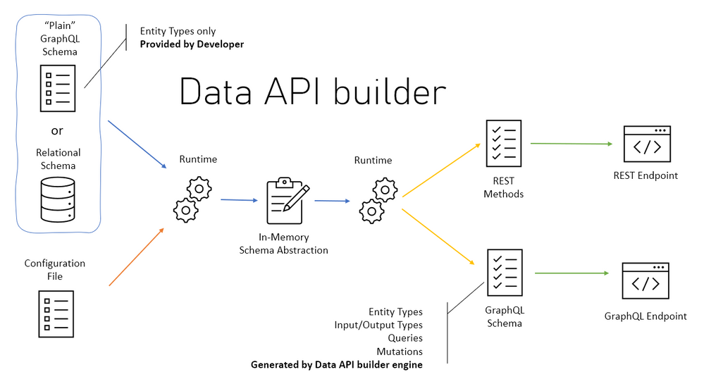

# Full Stack Application with DAB + Azure SQL and Vue.js

In this workshop, we will learn how to create a complete application using DAB, Azure SQL, and Vue.js. We will create an employee management application where we can add, edit, and delete employees.

## What is DAB? 

The Data API builder (DAB) is an open-source tool from Microsoft that converts REST and GraphQL into database queries. With Data API builder, you can generate code based on your database schema that can be accessed through a REST or GraphQL API that will work with any language, platform, or device.

It also comes with support for data organization behaviors that require additional code, such as pagination, filtering, and ready-to-use sorting, reducing the time needed to create the Back-End of your application. Another important point to mention is that DAB can be run locally, in a container, or as a Managed Service in Azure through the new Database Connection feature available in Azure Static Web Apps.

With this service, we can easily manipulate data with support for CRUD (Create, Read, Update, and Delete) operations. It also includes support for integrated authorization and relationships.

The most interesting part of the Data API builder is that you can use it offline (or locally) or in the cloud with Azure. This allows you to quickly create a fully functional Back-end with a database of your choice, aiming to accelerate the development process.

If you want to learn more about the Data API builder, the databases supported by DAB are:

- **[Azure SQL](https://azure.microsoft.com/products/azure-sql/?WT.mc_id=javascript-75515-gllemos)** 
- **[SQL Server](https://www.microsoft.com/sql-server/sql-server-downloads?WT.mc_id=javascript-75515-gllemos)**
- **[PostgreSQL](https://www.postgresql.org/)** 
- **[MySQL](https://www.mysql.com/)**
- **[Cosmos DB](https://azure.microsoft.com/products/cosmos-db/?WT.mc_id=javascript-75515-gllemos)**

## Prerequisites 

To follow this workshop, you will need to have the following software installed on your machine:

- **[Visual Studio Code](https://code.visualstudio.com/?WT.mc_id=javascript-75515-gllemos)**
- **[DAB CLI](https://github.com/Azure/data-api-builder)**
- **[Azure Data Studio](https://docs.microsoft.com/sql/azure-data-studio/download?WT.mc_id=javascript-75515-gllemos)**
- **[Node.Js](https://nodejs.org/en/)**
- **[Azure Static Web Apps](https://azure.microsoft.com/services/app-service/static/?WT.mc_id=javascript-75515-gllemos)** 
- **[.NET 6.0 SDK](https://learn.microsoft.com/azure/azure-functions/?WT.mc_id=javascript-75515-gllemos)** 

- **[Vue.Js](https://vuejs.org/)** 
  - Algumas extensões do Visual Studio Code:
    - **[GitHub Copilot](https://marketplace.visualstudio.com/items?itemName=GitHub.copilot&WT.mc_id=javascript-75515-gllemos)**
    - **[Azure Tools Extension](https://marketplace.visualstudio.com/items?itemName=ms-vscode.vscode-node-azure-pack&WT.mc_id=javascript-75515-gllemos)**
    - **[REST Client Extension](https://marketplace.visualstudio.com/items?itemName=humao.rest-client&WT.mc_id=javascript-75515-gllemos)**
    - **[Remote Containers Extension](https://marketplace.visualstudio.com/items?itemName=ms-vscode-remote.remote-containers&WT.mc_id=javascript-75515-gllemos)**

| **[Next: Session 02 ➡️](./02-session.md)**
