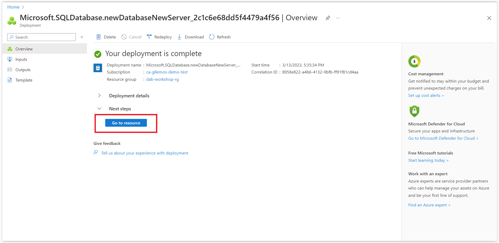

# Configuring Azure SQL DataBase

In this session, we will configure the Azure SQL database. Remember that at this point, you can use any database you want, whether it's local or in the cloud.

## Creating the Azure SQL Database 

> At this point, you will need an Azure account to create the database. If you don't have an account, you can create one (for free account) by clicking **[HERE](https://azure.microsoft.com/free/?WT.mc_id=javascript-75515-gllemos)**.

> And if you are a student or teacher, you can create an account with $100 credit and no credit card required **[HERE](https://azure.microsoft.com/free/students/?WT.mc_id=javascript-75515-gllemos)**.

To create a database, you can follow the tutorial at: **[Quickstart: Create a single database - Azure SQL Database](https://learn.microsoft.com/azure/azure-sql/database/single-database-create-quickstart?view=azuresql&tabs=azure-portal&WT.mc_id=javascript-75515-gllemos)**. After completing the steps in this tutorial, return to our workshop. Oh! Another important detail:

> In item 18 on the `Additional Settings -> Data source` tab, you should select `None` and then click `Review + Create`.

After following all the steps above, you will see the following image and click on Go to resource.

After that, click on Connection strings and copy the connection string.

Keep this connection string, as we will need it later.

And click on the `ODBC` option and copy the connection string.

Now, let's move on to the next session.

**[⬅️ Back: Session 02](./02-session.md) | **[Next: Session 04 ➡️](./04-session.md)****
