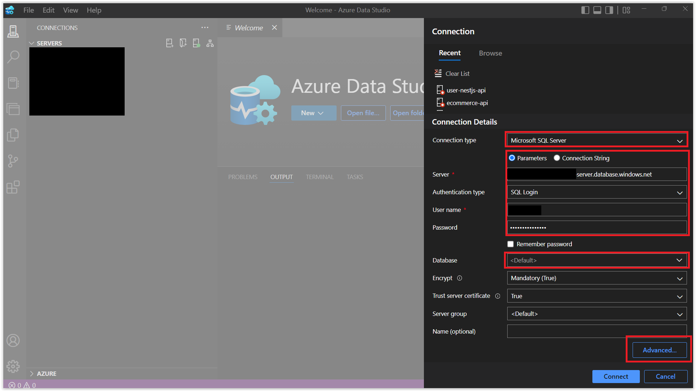
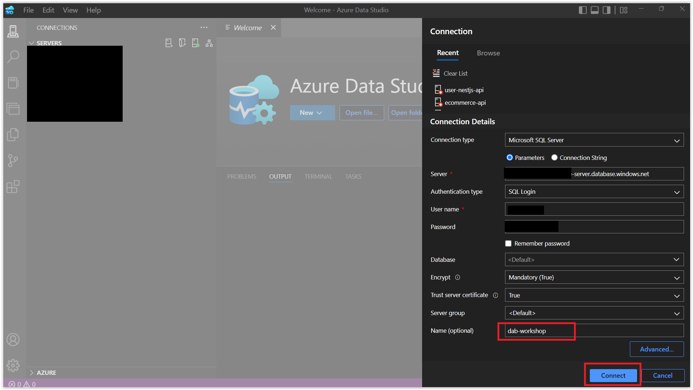
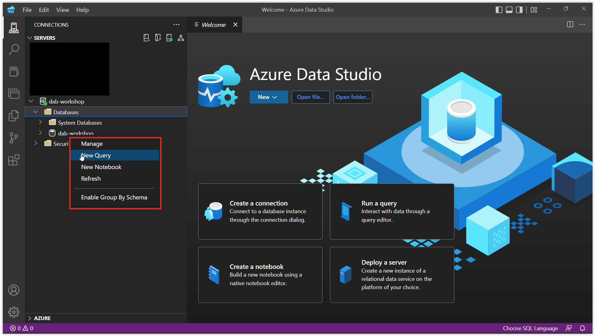
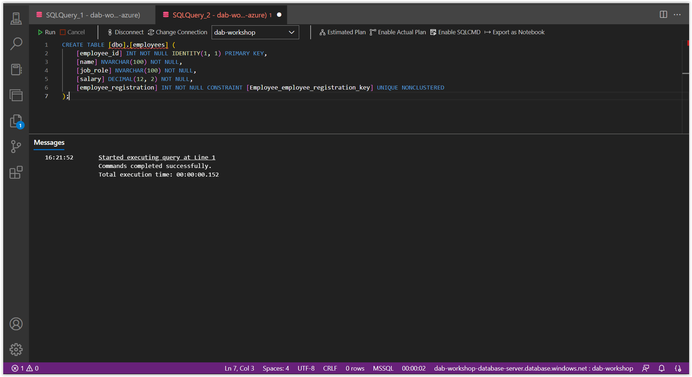

# Connecting to the Database with Azure Data Studio 

## Creating the Employee Table 

For our workshop, in order to learn the tool, we will be working with just one table:

* `dbo.employee`: contains the **Employee** table. 

And to create this table, I will be using a tool called **[Azure Data Studio](https://azure.microsoft.com/products/data-studio/?WT.mc_id=javascript-75515-gllemos)**. Azure Data Studio is an incredible tool. Its design is very similar to that of Visual Studio Code, and it is very lightweight and simple to use.

In fact, you can use extensions to work with, for example, Oracle, MySQL, or PostgreSQL. It also works with non-relational databases, like MongoDB and Azure CosmosDB, in addition to relational databases.

It also has strong language support for T-SQL, PowerShell, Python, KQL, Apache SparkTM, and PySpark. This is so that SQL Server, PostgreSQL, and Azure Data Explorer can all be managed and queried from the same place. Additionally, it is multi-platform and can be used on Windows, Linux, and Mac.

Well, after downloading the tool, let's connect to our database. To do this, we will click on the `New Connection` button and fill in the information as shown in the image below:

> If the status of your Azure SQL service is 'Paused' in the Azure Portal, you will need to go to: `Settings -> Compute + Storage -> Compute Hardware -> Auto-pause Delay` and uncheck the `Enable auto-pause` option, and then click `Apply` to make the service work again.


Then, simply enter the connection information for the database we created earlier, as shown in the image below. However, click on Advanced so that we can enter the port of our database, which in this case is `1433`.



Return to the main screen and click on the Database dropdown. A new window will appear called `Create new firewall rule`. This window will display the IP of your machine and, consequently, allow you to connect to your Azure account. Click on `Add an account` and log in with your Azure account. Your account credentials and `Azure tenant` will appear. After that, click `OK`.


After that, simply name this connection. In my case, I named it `dab-workshop` and clicked `Connect`.



Now, let's create our `Employee` table. To do this, right-click on the database you created (as shown in the image below) and click on `New Query`. Then, paste the code below and click `Run` to execute the script.



<details><summary><b>dbo.employee.sql</b></summary>
<br/>

```sql
CREATE TABLE [dbo].[employees] (
    [employee_id] INT NOT NULL IDENTITY(1, 1) PRIMARY KEY,
    [name] NVARCHAR(100) NOT NULL,
    [job_role] NVARCHAR(100) NOT NULL,
    [salary] DECIMAL(12, 2) NOT NULL,
    [employee_registration] INT NOT NULL CONSTRAINT [Employee_employee_registration_key] UNIQUE NONCLUSTERED
);
```
</details>
<br/>

If you see the message `1 row(s) affected` it means that the table was created successfully.



Now that we see that our connection is working and our table has been created, let's continue with our workshop in the next section.

**[⬅️ Back: Session 03](./03-session.md) | **[Next: Session 05 ➡️](./05-session.md)****