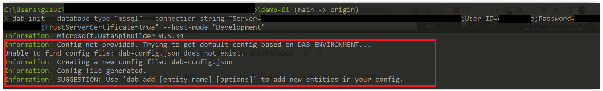

# Creating the configuration file for DAB (Data API Builder)

In this section, we will learn how to configure the configuration file of DAB (Data API Builder) so that we can generate our APIs.

The Data API Builder uses the Azure Databases engine, which requires a configuration file. We will specify which database DAB will connect to and which entities, along with their properties, the API will expose through this file.

To do this, we will use the DAB CLI to initialize the configuration file. To do this, run the command below (in your terminal:

> Changing the information in your connection string and the `demo-01` project folder (or as you have set it up)

```bash
dab init --database-type "mssql" --connection-string "Server=localhost;Database=<database-name>;User ID=<user>;Password=<password>;TrustServerCertificate=true" --host-mode "Development"
```

After running the above command, a file named `dab.config.json` will be created in the root of your project. This file is the DAB configuration file.

> **Note:** The DAB configuration file is a JSON file. You can edit it manually, but it is recommended that you use the DAB CLI to generate the configuration file.

Even though the following message shows up in the terminal, you don't need to worry. The configuration file was created successfully.



<details><summary><b>Example of a generated file: dab.config.json</b></summary>
<br/>

```json
{
  "$schema": "https://github.com/Azure/data-api-builder/releases/download/v{dab-version}/dab.draft.schema.json",
  "data-source": {
    "database-type": "mssql",
    "options": {
      "set-session-context": false
    },
    "connection-string": "Server=localhost;Database=<database-name>;User ID=<user>;Password=<password>;TrustServerCertificate=true"
  },
  "runtime": {
    "rest": {
      "enabled": true,
      "path": "/api"
    },
    "graphql": {
      "allow-introspection": true,
      "enabled": true,
      "path": "/graphql"
    },
    "host": {
      "mode": "development",
      "cors": {
        "origins": [],
        "allow-credentials": false
      },
      "authentication": {
        "provider": "StaticWebApps"
      }
    }
  },
  "entities": {}
}
```

</details>
<br/>

You can see that the DAB configuration file is a JSON file. It has some properties that define the type of database that will be used. In this case, in the `data-source` property, you will define which database will be used, which can be: MySQL, PostgreSQL, SQL Server, or another database of your choice.

If you want to get more information about the DAB configuration file, access the **[official documentation](https://github.com/Azure/data-api-builder/blob/main/docs/configuration-file.md)**.

In this file, depending on the number of tables you have, you can define relationships of 1 to 1, 1 to N, and N to N. The sky's the limit here.

## Setting the environment variables of the connection string

If you take a look at the `dab.config.json` file, you will notice that our connection string is exposed. This is a problem that we need to solve. To do so, please open the `dab.config.json` file and replace the connection string with the following:

<details><summary><b>Example of a generated file: dab.config.json</b></summary>
<br/>

```json
"connection-string": "@env('DATABASE_CONNECTION_STRING')"
```

</details>
<br/>

You might be wondering, "But how do I set this environment variable?" Well, there are three ways to do it.

### Case 1: Using Command Prompt

If you are using Command Prompt, you can set the environment variable as follows:

```bash
export DATABASE_CONNECTION_STRING='<YOUR-CONNECTION-STRING>'
```

### Case 2: Using PowerShell

If you are using PowerShell, you can set the environment variable as follows:

```powershell
$env:DATABASE_CONNECTION_STRING='<YOUR-CONNECTION-STRING>'
```

But it may happen that you are unable to set the environment variable on your machine using these methods. Let's move to the third case.

### Case 3: Defining the environment variable on the computer

#### Windows users

If you are a Windows user, you can set the environment variable as follows:

1. Right-click on the `Start` button and select `Control Panel`.
2. In the `Control Panel` window, select `System and Security`.
3. In the `System and Security` window, select `System`.
4. In the `System` window, select `Advanced system settings`.
5. In the `Advanced system settings` window, select `Environment Variables`.
6. In the `Environment Variables` window, select `New...` in the `System variables` section.
7. In the `New System Variable` window, enter the following information:
     - Variable name: `DATABASE_CONNECTION_STRING`
    - Variable value: `<YOUR-CONNECTION-STRING>`
8. Click `OK` to save the changes.

#### Linux and Mac users

If you are a Linux or Mac user, you can set the environment variable as follows:

1. Open the `~/.bashrc` file in your favorite IDE. 
2. Add the following line to the end of the file: 

```bash	
export DATABASE_CONNECTION_STRING = "YOUR-CONNECTION-STRING>" 
```
3. Save and close the file.

> **Note**: Every time you create a new connection string for different databases, you will need to define a new environment variable. Be careful not to confuse the environment's variables.

Great! Now that we have defined the connection string, let's move on to the next step.

## Adding Entities to the Configuration File

Now that we've made this file, we can use it to decide which entities the API will show. To do this, we will use the DAB CLI to generate the configuration file. To do this, run the command below (in your terminal:

```bash
dab add employee --source dbo.employees --permissions "anonymous:*"
```

> If you prefer, you can also add the entities manually to the configuration file. To do this, just add the entity to the dab.config.json file and define the properties you want to expose.

At the moment we run the above command, the DAB CLI will add the `Employee` entity to the configuration file, as shown in the example below:

<details><summary><b>Example of a generated file: dab.config.json</b></summary>
<br/>

```json
"entities": {
    "Employee": {
      "source": "dbo.employees",
      "permissions": [
        {
          "role": "anonymous",
          "actions": [
            "*"
          ]
        }
      ]
    }
```
</details>
<br/>

> **Note:** Entity names are case-sensitive. For example, if you define the entity as `Employee`, DAB will generate the entity as `Employee`. If you define the entity as an employee, DAB will generate the entity as an employee. However, there is a guide to best practices that we recommend you follow. To learn more, access the **[official documentation](https://github.com/Azure/data-api-builder/blob/main/docs/best-practices.md)**.

In the `permissions` part, we define who (in terms of roles) can access the related entity and what actions are intended. And the actions in this case are the CRUD operations: create, read, update, and delete. But in the `role` part, we will set it to `anonymous` for demonstration purposes so that anyone can do the CRUD operations for our `Employee` entity without needing to be authenticated.

> Never use anonymous in production. Always define the roles according to the needs of your project.

## Configuring the CORS

CORS is a way for a website to get resources from a server on a different domain than its own.For example, if you have a website at https://www.contoso.com and want to access a resource at https://www.fabrikam.com, CORS will allow you to do so.

To make things easier, as we will be integrating DAB with our frontend, we will configure CORS to allow any site to access our API.

If you look at the `dab.config.json` file, you will see a property called `cors`. Simply add the value `*` to allow CORS to permit any site to access our API.

<details><summary><b>dab.config.json</b></summary>
<br/>

```json
(...)
"host": {
      "mode": "development",
      "cors": {
        "origins": ["*"],
        "allow-credentials": false
      },
      "authentication": {
        "provider": "StaticWebApps"
      }
    }
  
(...)
```

</details>
<br/>

Great! Now we can actually start using our API through the DAB CLI. But we'll cover that in the next section.

**[⬅️ Back: Session 04](./04-session.md) | **[Next: Session 06 ➡️](./06-session.md)****
