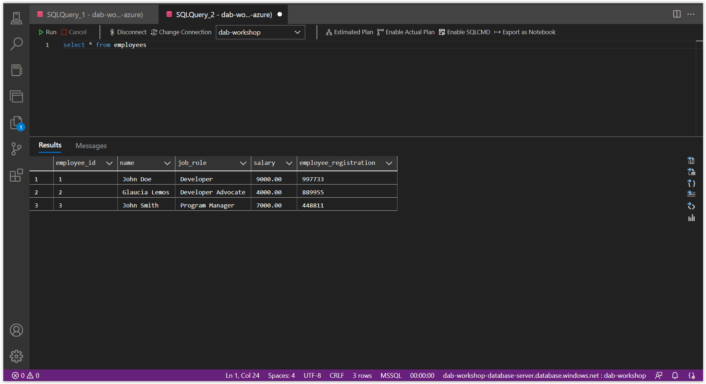
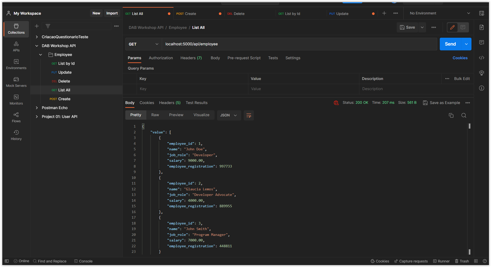

# Using Data API builder with an Azure SQL Database

In this session, we will learn how to use the Data API builder to connect our API with the Azure SQL Database.

Since we finished setting up the database with the DAB CLI in the last session, we are now ready to use our API. To do this, run the following command:

```bash
dab start --no-https-redirect
```

> **Note:** The `dab start --no-https-redirect` command will start the DAB server and expose our API. To stop the server, just press `Ctrl+C`.

If you run the command and the message appears as shown in the image below, it means that the server has started successfully. Note that the indicated port is `5000`.


## Running the Endpoints 

Now is the time to test our API. To do this, we will use **[Postman](https://www.postman.com/)**. But feel free to use any other tool you prefer.

Since our entity is an `employee`, the route will be `/api/employee`.

The supported HTTP verbs are:

- `GET`: to get data 
- `POST`: to create data;
- `PUT`: to update data
- `PATCH`: to partially update the data.
- `DELETE`: to delete data Let's now test all the routes!

## Route: POST 

To create a new employee, open Postman and create a new request:

- `POST`: `http://localhost:5000/api/employee`

In Postman, choose the option `Body -> raw` and include the following JSON:

```json
{
    "name": "John Doe",
    "job_role": "Developer",
    "salary": 9000,
    "employee_registration": 997733
}
```

See the image below:


And to make sure that it was saved in the database, open Azure Data Studio and execute the following command:

```sql
SELECT * FROM employees
```

See the image below:



I already have some data in my database, but you can see that a new employee has been created.

## Route: GET 

To get all employees, open Postman and create a new request:

- `GET`: `http://localhost:5000/api/employee `

It will return all registered employees



## Route: GET by ID 

To get a specific employee, open Postman and create a new request:

- `GET`: `localhost:5000/api/employee/employee_id/2`

It will return the employee's ID 2.


Note that the route is composed of 3 parts:

- `/api/employee`: is the base route 
- `/employee_id`: is the primary key column. 
- `/2`: is the value of the primary key 

## Route: PUT 

To update an employee, open Postman and create a new request:

- `PUT`: `http://localhost:5000/api/employee/employee_id/3` 

In Postman, choose the option `Body -> raw` and include the following JSON:


```json
{
    "name": "John Smith",
    "job_role": "Program Manager",
    "salary": 8000.00,
    "employee_registration": 448811
}
```


## Route: DELETE 

To delete an employee, open Postman and create a new request:

- `DELETE`: `http://localhost:5000/api/employee/employee_id/3` 

And to make sure that it was deleted from the database, open Azure Data Studio and execute the following command:

```sql
SELECT * FROM employees
```


 If it was successfully deleted, the record will no longer be displayed.

If all these routes were executed successfully, congratulations! Now we need to integrate our API with our frontend. For this, let's move on to the next session.

**[⬅️ Back: Session 05](./05-session.md) | **[Next: Session 07 ➡️](./07-session.md)****
