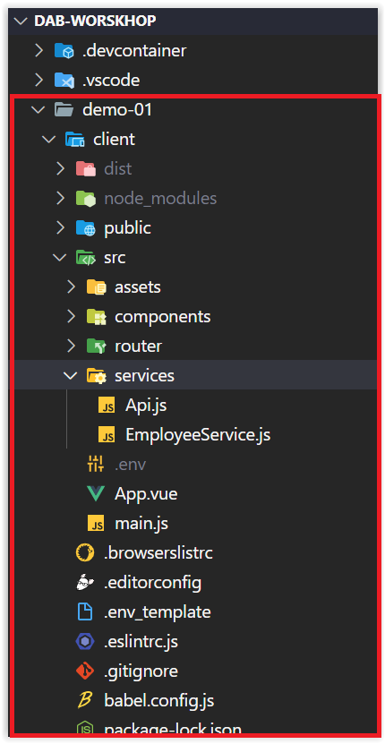
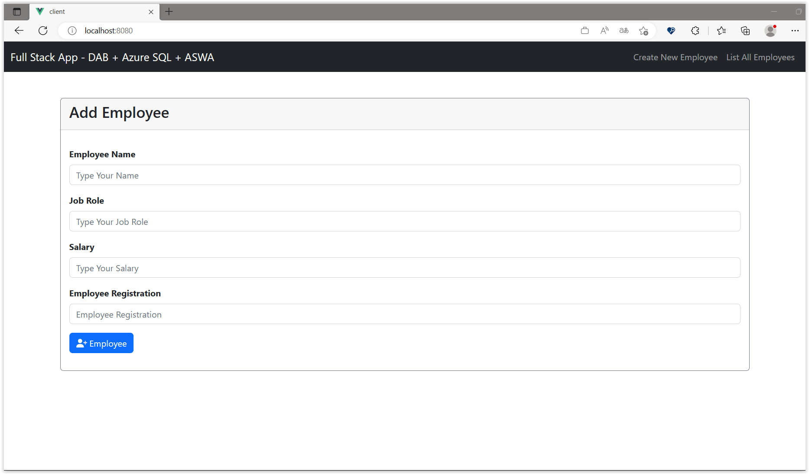
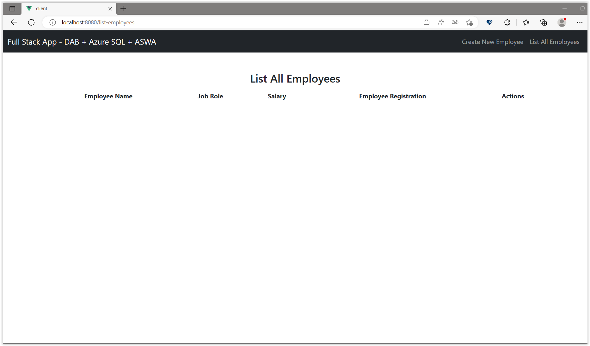
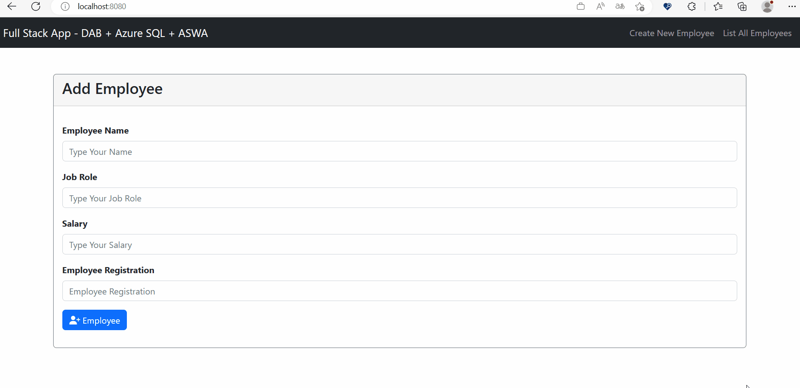

# Integrating DAB with Client-side (Front-End)

In this section, we'll connect DAB to Vue.js, a JavaScript framework for building user interfaces.

## Understanding the Front-End Application

To focus on integration with DAB, we will use a pre-built Vue.js application. In this repository itself, we have a folder called demo-01 and inside it another folder called client. This folder contains a Vue.js application, as shown in the image below:



To run the application, we need to first install the dependencies. To do this, open the terminal, navigate to the `client` folder, and run the command:

```bash
npm install
``` 

After installing the dependencies, run the command below to start the application.

```bash
npm run serve
```

Now, open the browser and access the URL `http://localhost:8080`. You will see the following screen:



The application is very simple. It has some fields to enter some data for the `employee`. There is also a page to list the registered `employees`, edit them, and delete them.



The list, edit, and delete pages will not work at this time because we need to integrate the DAB with the application.

Let's do that now, and I won't lie to you; it's pretty simple.

## Integrating DAB with Front-End Application

To integrate DAB with the application, we need to make some changes to the front-end code.

Go to the `client` folder. Then go to the `services` folder and open the `Api.js` file. This file is responsible for initializing axios, which is a library for making HTTP requests.

```javascript
import axios from "axios";

export default () =>
  axios.create({
    baseURL: "http://localhost:5000/api",
  });
```

Here, we are configuring axios to point to the URL `http://localhost:5000/api`. This URL is the URL of our DAB server.

Now, let's change the URLs to point to the DAB.

To do this, open the `EmployeeService.js` file and change the code to the code below:

<details><summary>Método: createNewEmployee</summary>

```javascript
  async createNewEmployee(employee) {
    try {
      const response = await Api().post('/employee', employee);
      return response.data.value;
    } catch (error) {
      if (error.response.status === 409) {
        throw new Error('Employee already exists!', error);
      }
      console.error(error);
      throw new Error('Error!');
    }
  },

```

</details>
</br>

The same goes for the other methods.

<details><summary>Método: getAllEmployees</summary>

```javascript
  async getEmployees() {
    try {
      const response = await Api().get('/employee');
      return response.data.value;
    } catch (error) {
      console.error(error);
      throw new Error('Error!');
    }
  },
```

</details>
</br>

<details><summary>Método: getEmployeeById</summary>

```javascript
  async getEmployeeId(id) {
    try {
      const response = await Api().get(`/employee/employee_id/${id}`);
      return response.data.value[0];
    } catch (error) {
      if (error.response.status === 404) {
        throw new Error('Employee not found!', error);
      }
      console.error(error);
      throw new Error('Error!');
    }
  },
```

</details>
</br>

<details><summary>Método: updateEmployee</summary>

```javascript
  async updateEmployee(employee) {
    try {
      const id = employee.employee_id;
      const removeEmployeeId = { ...employee };
      delete removeEmployeeId.employee_id;

      const response = await Api().put(`/employee/employee_id/${id}`, removeEmployeeId);
      if (response.status === 200) {
        return response.data.value;
      }
      throw new Error('Error!');
    } catch (error) {
      if (error.response.status === 404) {
        throw new Error('Employee not found!', error);
      }
      console.error(error);
      throw new Error('Error!');
    }
  },
```

</details>
</br>

<details><summary>Método: deleteEmployee</summary>

```javascript
  async deleteEmployee(id) {
    try {
      const response = await Api().delete(`/employee/employee_id/${id}`);
      return response.data;
    } catch (error) {
      console.error(error);
      throw new Error('Error!');
    }
  },
```

</details>
</br>

Now, let's run the application again. Remember that, due to the use of CORS, we need to run dab as follows:

```bash
dab start --no-https-redirect
```

Open another terminal and run the front-end application:

```bash
npm run serve
```

Now, open the browser and access the URL `http://localhost:8080`. You will see the following screen:



And voilà! The application is integrated with the DAB.

But what if I want to use Azure Static Web Apps that are integrated with DAB to deploy the app?How do I do that?

We'll see that in the next session.

**[⬅️ Back: Session 06](./06-session.md) | **[Next: Session 08 ➡️](./08-session.md)****