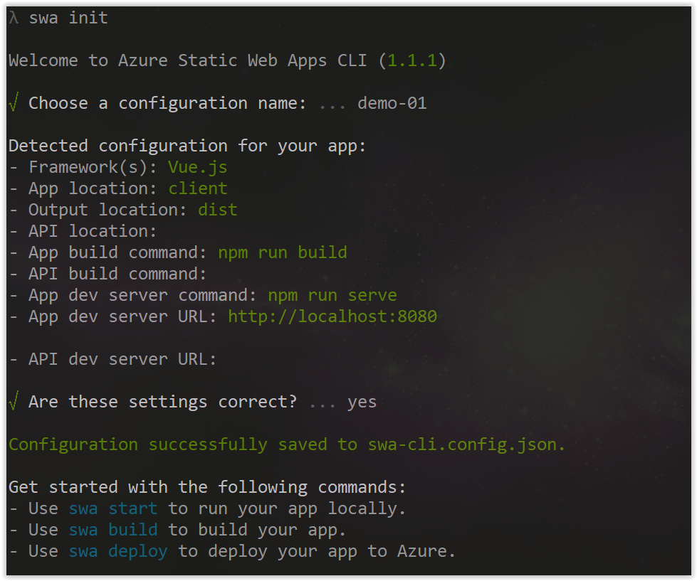
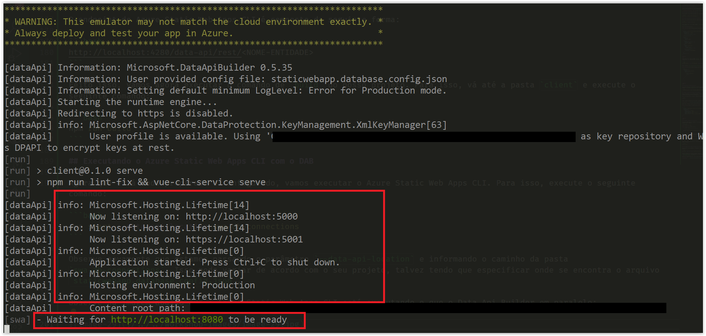
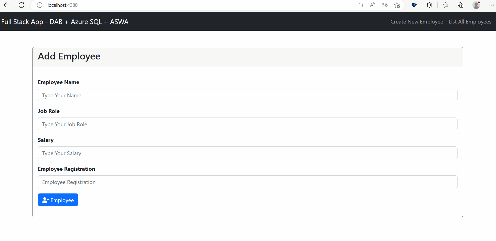

# Integrating DAB with Azure Static Web Apps

In this session, we will learn how we can integrate the Data Api Builder with Azure Static Web Apps using a tool called **[Azure Static Web Apps CLI](https://azure.github.io/static-web-apps-cli/)**.

## What is Azure Static Web Apps?

Azure Static Web Apps is a service for hosting both static and dynamic web apps. It lets you make and host modern web apps without having to manage servers or infrastructure. It combines the power of Azure App Service and GitHub Actions to make a continuous development and continuous deployment (CI/CD) workflow for both static and dynamic applications.

One of the best things about this service is that you can host your static and dynamic applications for free.

If you want to learn more about Azure Static Web Apps, you can get more information at the link below:

- **[Documentação Oficial - Azure Static Web Apps](https://docs.microsoft.com/azure/static-web-apps/overview?WT.mc_id=javascript-75515-gllemos)**

## What is Azure Static Web Apps CLI?

Azure Static Web Apps CLI is a command-line tool that lets you create, configure, and deploy both static and dynamic applications in Azure Static Web Apps.

- **[Documentação Oficial - SWA CLI](https://azure.github.io/static-web-apps-cli/docs/intro)**

## Installing Azure Static Web Apps CLI

To install the Azure Static Web Apps CLI, you can use the following command:

```bash
npm install -g @azure/static-web-apps-cli
```

## Creating DAB Configuration with SWA CLI

To create a DAB configuration with the SWA CLI, you can use the following command:

```bash
swa db init --database-type mssql
``` 

This command will create a folder called `swa-db-connections`, and inside it, we will have a file called `staticwebapp.database.config.json`.

Check the contents of the file:

<details><summary>staticwebapp.database.config.json</summary>

```json
{
  "$schema": "https://github.com/Azure/data-api-builder/releases/download/v0.5.35/dab.draft.schema.json",
  "data-source": {
    "database-type": "mssql",
    "options": {
      "set-session-context": false
    },
    "connection-string": ""
  },
  "runtime": {
    "rest": {
      "enabled": true,
      "path": "/rest"
    },
    "graphql": {
      "allow-introspection": true,
      "enabled": true,
      "path": "/graphql"
    },
    "host": {
      "mode": "production",
      "cors": {
        "origins": ["http://localhost:4280"],
        "allow-credentials": false
      },
      "authentication": {
        "provider": "StaticWebApps"
      }
    }
  },
  "entities": {}
}
```

</details>
</br>

Now let's create our `Employee` entity. It will be very similar to what we did in one of the previous sessions. This command should be executed inside the `swa-db-connections` folder:

```bash
dab add employee --source dbo.employees --permissions "anonymous:*" -c staticwebapp.database.config.json
```

Open the `staticwebapp.database.config.json` file and see that we now have the `Employee` entity:

<details><summary>staticwebapp.database.config.json</summary>

```json
  "entities": {
    "employee": {
      "source": "dbo.employees",
      "permissions": [
        {
          "role": "anonymous",
          "actions": [
            "*"
          ]
        }
      ]
    }
  }

(...)
```

</details>
</br>

## Configuring the Connection String

We need to configure the connection string of our database, just like we did in DAB. To do this, open the `staticwebapp.database.config.json` file and change the value of the `connection-string` property to the following:

```json
"connection-string": "@env('DATABASE_CONNECTION_STRING')"
```

## Creating the SWA CLI Configuration File

Now we need to create another file called `swa-cli.config.json`. This file will be responsible for storing the Azure Static Web Apps CLI configurations.

To create this file, run the following command at the root of the project:

```bash
swa init
```

There will be some questions that you will need to answer according to your project. See the image below:



Now open the file and see its contents:

<details><summary>swa-cli.config.json</summary>

```json
{
  "$schema": "https://aka.ms/azure/static-web-apps-cli/schema",
  "configurations": {
    "dab-swa-azure-sql-workshop": {
      "appLocation": "client",
      "outputLocation": "dist",
      "appBuildCommand": "npm run build",
      "run": "npm run serve",
      "appDevserverUrl": "http://localhost:8080"
    }
  }
}
```

</details>
</br>

## Changing the Endpoint on the Client-Side

We now need to point the endpoint to SWA for our project. To do this, open the `client/src/Api.js` file and change the endpoint to the following:

```javascript
import axios from 'axios';

export default () => axios.create({
  // ==> DAB request
  // baseURL: 'http://localhost:5000/api',

  // ==> ASWA request
  baseURL: 'http://localhost:4280/data-api/rest',
});
```

Note that we are now pointing to the endpoint of the Azure Static Web Apps CLI. Another interesting point is that this endpoint is different from the endpoint we used in DAB. This is because the Azure Static Web Apps CLI is a proxy that communicates between your application and the Data Api Builder.

The Azure Static Web Apps CLI endpoint is composed as follows:

```bash
http://localhost:4280/data-api/rest/<NOME-ENTIDADE>
```

After doing this, let's run the build command for our project. To do this, go to the `client` folder and run the following command:

```bash
npm run build
``` 

## Running the Azure Static Web Apps CLI with DAB

Now that everything is prepared and configured, let's run the Azure Static Web Apps CLI. To do this, run the following command:

```bash
swa start --data-api-location swa-db-connections
```

Note again that we are passing the `--data-api-location` parameter and indicating the path of the `swa-db-connections` folder. This may vary according to your project; you may have to specify where the `staticwebapp.database.config.json` file is located.

Note in the image below that the Azure Static Web Apps CLI is running in parallel with the Data Api Builder:



Now open the browser and access the following address:

```bash
http://localhost:4280/
```

And you will see that the application will work normally:



If everything went well, you should see the application working normally.

Now we are ready to deploy our project on Azure Static Web Apps. But we will do that in the last session of our workshop.

**[⬅️ Back: Session 07](./07-session.md)**
| **[Next: Session 09 ➡️](./09-session.md)**