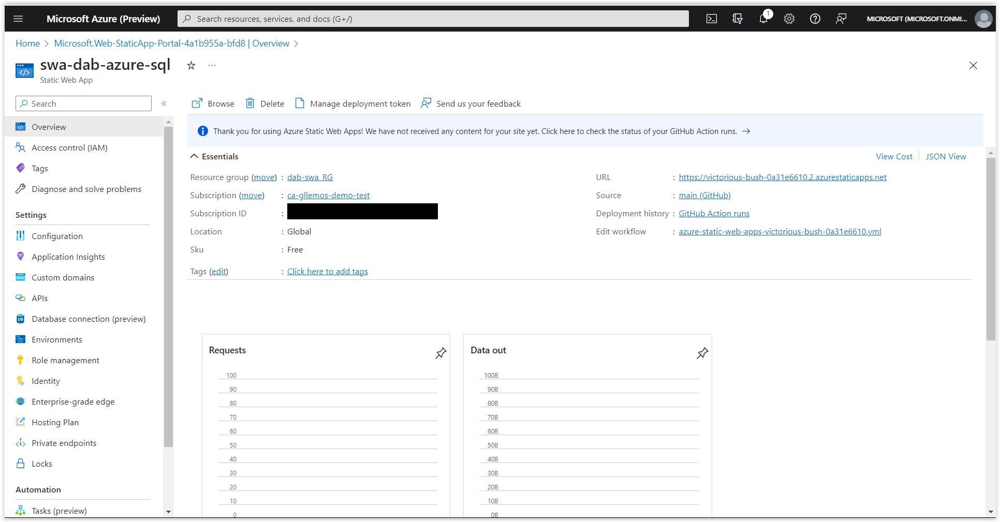
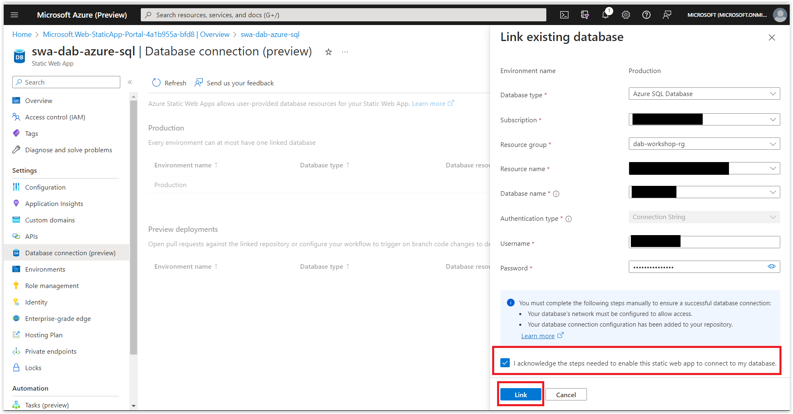
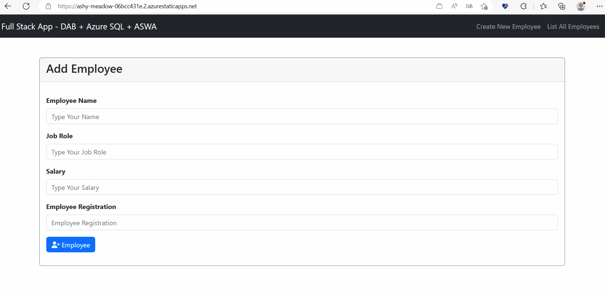

# Application Deployment on Azure Static Web Apps

In this session, we will deploy the application on Azure Static Web Apps. At this point, you will need to have an Azure account.

> If you don't have one, you can create a free account by clicking **[HERE](https://azure.microsoft.com/free/?WT.mc_id=javascript-75515-gllemos)**. And if you are a student or teacher, you can create an account with $100 credit and without a credit card by clicking **[HERE](https://azure.microsoft.com/free/students/?WT.mc_id=javascript-75515-gllemos)**.

## Creating an Azure Static Web Apps Configuration File

To avoid problems with Azure Static Web Apps configuration, we will create a configuration file for it. To do this, we will create a file called `staticwebapp.config.json` inside the `client` folder. The content of the file should be as follows:

```json
{
  "navigationFallback": {
    "rewrite": "/index.html",
    "exclude": ["/css/*", "/js/*", "/api/*", "/favicon.ico"]
  }
}
```

What will this file do? It will configure Azure Static Web Apps to always redirect to the `index.html` page when a page is not found. Additionally, it will exclude some files that do not need to be sent to Azure Static Web Apps.

## Creating the GitHub Repository 

To deploy the application on Azure Static Web Apps, we need to create a repository for the application on GitHub.

> If you don't know how to create a repository on GitHub, you can follow the tutorial: **[Creating a new repository](https://docs.github.com/en/github/getting-started-with-github/create-a-repo)**.

## Integrating the application with Azure Static Web Apps 

Well, now that we have the project on GitHub, it's time to integrate the application with Azure Static Web Apps. To do this, open the Azure Portal and log in with the account you created earlier.

Then, go to the search bar and type `Static Web Apps`. Click on the service that appears.


After clicking on the service, click on `Create`. A new window will open. In this window, you will need to fill in some fields:

- **Subscription**: Select the subscription you created earlier.
- **Resource Group**: Create a new resource group.
- **Static Web App name**: Enter a name for your application.
- **Hosting Plan**: Select `Free`.
- **Location**: Select the region you want.
- **Deployment details**:  Select GitHub.
- **GitHub Account**: Select the GitHub account you created earlier or the one you have. 
- **Organization**: Select the organization where the repository is located.
- **Repository**: Select the repository you created earlier.
- **Branch**: Select the branch you want. In my case, it's main.
- **Build Preset**: Select `Vue.js`.
- **App location**: Enter `./client`.
- **Api location**: Leave it blank.
- **Output location**: Enter `dist`. See the images below for how the configuration looks:


Click on `Review + create` and then `Create`. Wait a few minutes for Azure Static Web Apps to be created.

And then click on `Go to resource`.

When you click on `Go to resource`, you will be redirected to the Azure Static Web Apps page. On this page, you will see some information about your application. See the image below:



## Connecting the database to Azure Static Web Apps

Now that we have the service created, we need to connect the application's database. To do this, on the same Azure Static Web Apps page, click on `Database Connection (preview)`.


A window will open. In this window, click on `Link existing database`.

Again, a window will open. In this window, you will need to fill in some fields:

- **Database type**: Select `SQL Database`. 
- **Subscription**: Select the subscription you created earlier. 
- **Resource Group**: Select the resource group you created earlier. 
- **Resource name**: Select the name of the database you created earlier. 
- **Database name**: Select the name of the database you created earlier. 
- **Username**: Enter the name of the user you created earlier. 
- **Password**: Enter the password you created earlier. 

If you have any doubts, see the image below for the configuration:


Before clicking on `Link`, we need to check if the database is allowing access to Azure Static Web Apps. To do this, we will open the Azure portal (without closing the other tab) and go to the database server we created earlier.

Go to `Security` and then `Networking`. A new window will open. In this window, go to the end in `Exceptions` and click on `Allow Azure Services and resources to access this server` and then on `Save`.


Once this is done, we can now click on: `I acknowledge the steps needed to enable this static web app to connect to my database` and then onto `Link`.



Now we need to define the data_api_location. How will we do this? Open your command prompt and type the following command:

```bash
git pull
```

By doing this, you will see a folder called `.github` in the project root. In this folder, you will see a file called `workflows`. In this folder, you will see a file called `azure-static-web-apps-<app-name>.yml`. 

Open the file, and you will see that it is like this:


> This file is generated by my GH Actions. Yours will be generated with some different secrets.

<details><summary>azure static web apps yaml file (sample)</summary>

```yml
name: Azure Static Web Apps CI/CD

on:
  push:
    branches:
      - main
  pull_request:
    types: [opened, synchronize, reopened, closed]
    branches:
      - main

jobs:
  build_and_deploy_job:
    if: github.event_name == 'push' || (github.event_name == 'pull_request' && github.event.action != 'closed')
    runs-on: ubuntu-latest
    name: Build and Deploy Job
    steps:
      - uses: actions/checkout@v2
        with:
          submodules: true
      - name: Build And Deploy
        id: builddeploy
        uses: Azure/static-web-apps-deploy@v1
        with:
          azure_static_web_apps_api_token: ${{ secrets.AZURE_STATIC_WEB_APPS_API_TOKEN_ASHY_MEADOW_06BCC431E }}
          repo_token: ${{ secrets.GITHUB_TOKEN }} # Used for Github integrations (i.e. PR comments)
          action: 'upload'
          ###### Repository/Build Configurations - These values can be configured to match your app requirements. ######
          # For more information regarding Static Web App workflow configurations, please visit: https://aka.ms/swaworkflowconfig
          app_location: './client'
          output_location: 'dist'
          ###### End of Repository/Build Configurations ######

  close_pull_request_job:
    if: github.event_name == 'pull_request' && github.event.action == 'closed'
    runs-on: ubuntu-latest
    name: Close Pull Request Job
    steps:
      - name: Close Pull Request
        id: closepullrequest
        uses: Azure/static-web-apps-deploy@v1
        with:
          azure_static_web_apps_api_token: ${{ secrets.AZURE_STATIC_WEB_APPS_API_TOKEN_ASHY_MEADOW_06BCC431E }}
          action: 'close'
```

</details>
</br>

Once the GitHub Actions finish the jobs and show that everything is green.


In the Build job of the GitHub Actions, it shows the link to the application itself. Click on the link and see if the application is working.


Let's see the application in action, which is now hosted in the cloud with the database integrated with the help of the Data Api Builder and Azure Static Web Apps.



If everything is working as expected, congratulations! You have completed the workshop.

If you want to see the final code of the project, access the GitHub repository by clicking **[HERE](https://github.com/glaucia86/dab-swa-azure-sql-workshop)**.

