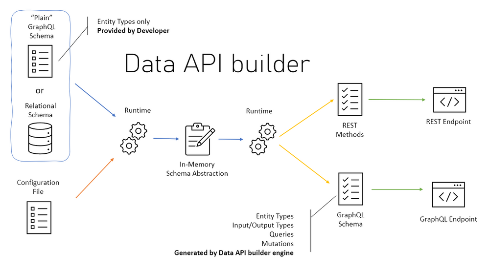

# Aplicação Full Stack com DAB + Azure SQL & Vue.js

Nesse workshop vamos aprender a criar uma aplicação completa utilizando o DAB, Azure SQL e o Vue.js. Vamos criar uma aplicação de gerenciamento de empregados, onde podemos cadastrar, editar e excluir funcionários.

## O que é o DAB?

O Data API builder (DAB) é uma ferramenta de código aberto da Microsoft que converte REST e GraphQL em consultas de Banco de Dados. Com Data API builder, você pode gerar código com base em seu esquema de banco de dados que pode ser acessado por meio de uma API REST ou GraphQL que funcionará com qualquer linguagem, plataforma ou dispositivo. 

Ele também vem com suporte para comportamentos de organização dos dados que requerem código adicional, como paginação, filtragem e classificação pronta para uso, reduzindo o tempo necessário para criar o Back-End da sua aplicação. Outro ponto importante a ser mencionado é que o DAB pode ser executado localmente, em contêiner ou como um Serviço Gerenciado no Azure, por meio do novo recurso de Conexão de Banco de Dados disponível no Azure Static Web Apps.

Com esse serviço, podemos facilmente manipular dados com suporte para operações CRUD (Create, Read, Update e Delete). Incluso também suporte para autorização integrada e relacionamentos. 

A parte mais interessante do Data API builder é que você poder usar de forma offline (ou localmente) ou na nuvem com o Azure. Permitindo assim, criar rapidamente um Back-end totalmente funcional com um Banco de Dados a sua escolha, visando justamente acelerar o processo de desenvolvimento.

Se você desejar aprender mais sobre o **[Data API builder](https://learn.microsoft.com/azure/data-api-builder/overview-to-data-api-builder?WT.mc_id=javascript-75515-gllemos)**

Os Bancos de Dados suportados pelo DAB são:

- **[Azure SQL](https://azure.microsoft.com/products/azure-sql/?WT.mc_id=javascript-75515-gllemos)** 
- **[SQL Server](https://www.microsoft.com/sql-server/sql-server-downloads?WT.mc_id=javascript-75515-gllemos)**
- **[PostgreSQL](https://www.postgresql.org/)** 
- **[MySQL](https://www.mysql.com/)**
- **[Cosmos DB](https://azure.microsoft.com/products/cosmos-db/?WT.mc_id=javascript-75515-gllemos)**

## Pré-requisitos

Para seguir esse workshop, você precisará ter instalado em sua máquina:

- **[Visual Studio Code](https://code.visualstudio.com/?WT.mc_id=javascript-75515-gllemos)**
- **[DAB CLI](https://github.com/Azure/data-api-builder)**
- **[Azure Data Studio](https://docs.microsoft.com/sql/azure-data-studio/download?WT.mc_id=javascript-75515-gllemos)**
- **[Node.Js](https://nodejs.org/en/)**
- **[Azure Static Web Apps](https://azure.microsoft.com/services/app-service/static/?WT.mc_id=javascript-75515-gllemos)** 
- **[.NET 6.0 SDK](https://learn.microsoft.com/azure/azure-functions/?WT.mc_id=javascript-75515-gllemos)** 

- **[Vue.Js](https://vuejs.org/)** 
  - Algumas extensões do Visual Studio Code:
    - **[GitHub Copilot](https://marketplace.visualstudio.com/items?itemName=GitHub.copilot&WT.mc_id=javascript-75515-gllemos)**
    - **[Azure Tools Extension](https://marketplace.visualstudio.com/items?itemName=ms-vscode.vscode-node-azure-pack&WT.mc_id=javascript-75515-gllemos)**
    - **[REST Client Extension](https://marketplace.visualstudio.com/items?itemName=humao.rest-client&WT.mc_id=javascript-75515-gllemos)**
    - **[Remote Containers Extension](https://marketplace.visualstudio.com/items?itemName=ms-vscode-remote.remote-containers&WT.mc_id=javascript-75515-gllemos)**
    

| **[Próximo: Sessão 02 ➡️](./02-session.md)**

