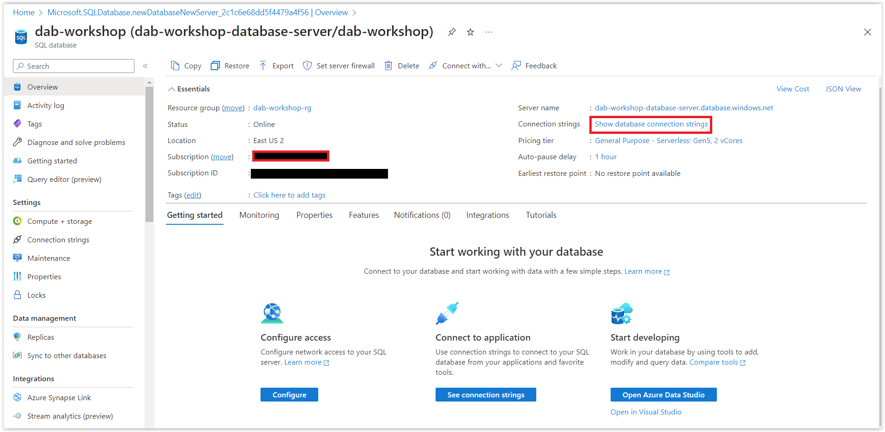

# Configurando a Base de Dados do Azure SQL

Nessa sessão, vamos configurar a Base de Dados do Azure SQL. Lembrando que você nesse momento poderá fazer uso de qualquer base de dados que desejar, seja ela local ou na nuvem.

## Criando o Banco de Dados - Azure SQL

> Nesse momento, você precisará da conta do Azure para criar o banco de dados. Se você não possui uma conta, você pode criar uma conta gratuita clicando **[AQUI](https://azure.microsoft.com/free/?WT.mc_id=javascript-75515-gllemos)**. 

> E, caso você seja estudante ou professor, você pode criar uma conta com crétido de $100 e sem necessidade de cartão de crédito **[AQUI](https://azure.microsoft.com/free/students/?WT.mc_id=javascript-75515-gllemos)**.

Para criar um banco de dados você pode seguir o tutorial em: **[Guia de Início Rápido: Criar um banco de dados individual – Banco de Dados SQL do Azure](https://learn.microsoft.com/azure/azure-sql/database/single-database-create-quickstart?view=azuresql&tabs=azure-portal&WT.mc_id=javascript-75515-gllemos)**. Depois de concluir os passos desse tutorial, retorne para o nosso workshop. Ah! Outro detalhe importante:

> No item **18** no tab **Additional settings -> Data source** você deve selecionar **None** e depois clicar em **Review + Create**.

Depois de seguir todos os passos acima, você verá a seguinte imagem e clique em **Go to resource**.

Após isso, clique em **Connection strings** e copie a string de conexão.

> Guarde essa connection string. Pois precisaremos dela depois.

E clique na opção na opção **ODBC** e copie a string de conexão.

Se tiver dúvidas como será criada a connection string, você pode copiar do **[.env_template](https://github.com/glaucia86/dab-worskhop/blob/main/demo-01/.env_template)** e substituir os valores.

Agora, vamos seguir para a próxima sessão.

**[⬅️ Voltar: Sessão 02](./02-session.md) | **[Próximo: Sessão 04 ➡️](./04-session.md)****
