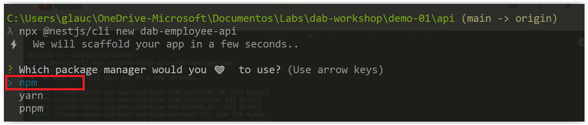
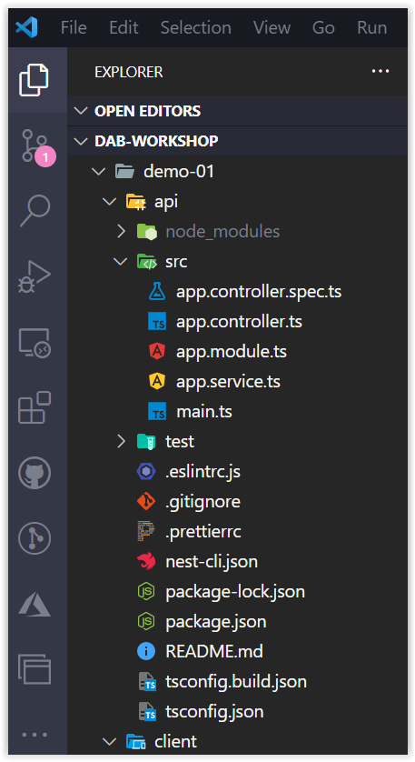
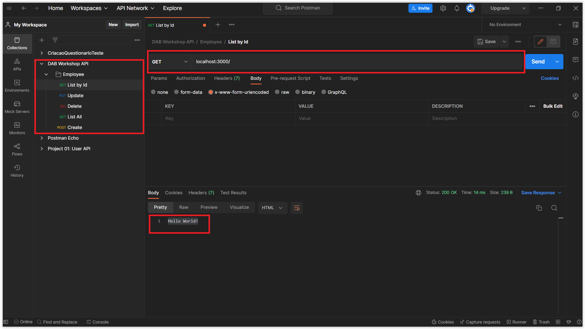
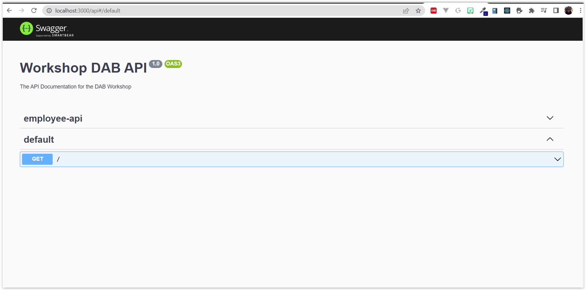

# Criando o Back-End com NestJs

Nessa sessão, vamos criar o back-end da nossa aplicação utilizando o NestJs. Mas, por que o NestJs? Pois para criar uma API com esse framework é muito simples e direto. Assim que, em pouco tempo teremos uma aplicação no server-side pronta!

Se vocês desejarem saber mais detalhes sobre o NestJs pode clicar **[AQUI](https://nestjs.com/)**.

## Criando o Projeto

Primeira coisa que precisamos fazer é criar o projeto com o NestJs. Para isso, crie uma pasta localmente em sua máquina chamada, por exemplo: `dab-project` e dentro dessa pasta, pedirei para você criar a pasta `client`.

E a pasta `api` criaremos usando o seguinte comando do NestJs:


```bash
npx @nestjs/cli new api
```

Aparecerá três opções de package manager que você pode usar no projeto. No nosso caso, estaremos optando por `npm`



A estrutura inicial do projeto ficará conforme a imagem abaixo:



Vamos instalar alguns pacotes que serão necessários para o projeto. Um deles é o **[TypeORM](https://typeorm.io/)**. Para isso, abra o terminal na pasta `api` e execute o seguinte comando:

```bash
npm install typeorm --save
```

Ótimo. Como nós iremos fazer uso do Azure SQL, precisamos instalar o driver do SQL Server. Para isso, execute o seguinte comando:

```bash
npm install mssql --save
```

E finalmente usaremos o Swagger. Para isso, instale o pacote:

```bash
npm install --save @nestjs/swagger
```

Finalizando as instalações necessários dos pacotes, vamos executar o projeto. Execute o comando:

```bash
npm run start:dev
```

Abre o Postman e digite o seguinte endereço: [http://localhost:3000](http://localhost:3000/)

> Se desejarem, podem criar uma `Collections` no Postman com todas as rotas do CRUD que iremos usar na aplicação conforme imagem abaixo



Se aparecer a mensagem 'Hello World' é porque a nossa aplicação está executando com sucesso!

## Incluindo o Swagger no Projeto

Estaremos fazendo uso do Swagger para mapear as rotas da nossa API. Para isso, precisamos incluir o Swagger no projeto. Para isso, abra o arquivo `main.ts` e inclua o seguinte código:

<details><summary><b>src/main.ts</b></summary>

```typescript
import { NestFactory } from '@nestjs/core';
import { DocumentBuilder, SwaggerModule } from '@nestjs/swagger';
import { AppModule } from './app.module';

async function bootstrap() {
  const app = await NestFactory.create(AppModule);

  const config = new DocumentBuilder()
    .setTitle('Workshop DAB API')
    .setDescription('The API Documentation for the DAB Workshop')
    .setVersion('1.0')
    .addTag('employee-api')
    .build();

  const document = SwaggerModule.createDocument(app, config);
  SwaggerModule.setup('api', app, document);

  await app.listen(3000);
}
bootstrap();
```
</details>
<br/>

Aqui nada de diferente do que a documentação do NestJs está pedindo para fazer em relação ao uso do **[SwaggerModule](https://docs.nestjs.com/openapi/introduction)**. Vamos testar se o Swagger está corretamente configurado. Para isso, execute o projeto e acesse o endereço no browser: **[http://localhost:3000/api](http://localhost:3000/api)**

```bash
npm run start:dev
```

Se ao digitar o endereço aparecer a seguinte tela, é porque o Swagger está funcionando corretamente:



Excelente! Agora vamos avançar para a próxima etapa.

**[⬅️ Voltar: Sessão 03](./03-session.md) | **[Próximo: Sessão 05 ➡️](./05-session.md)****


