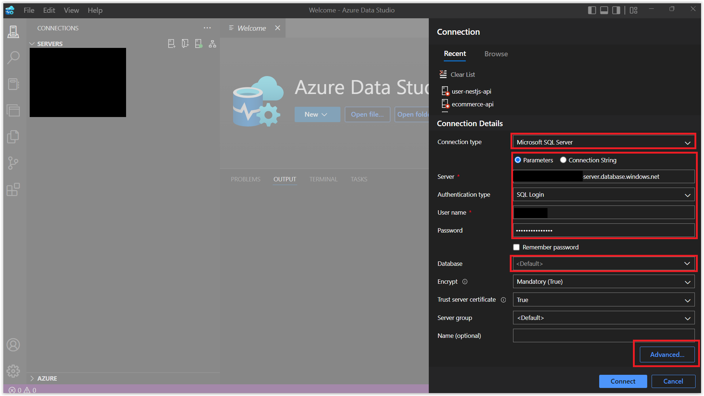
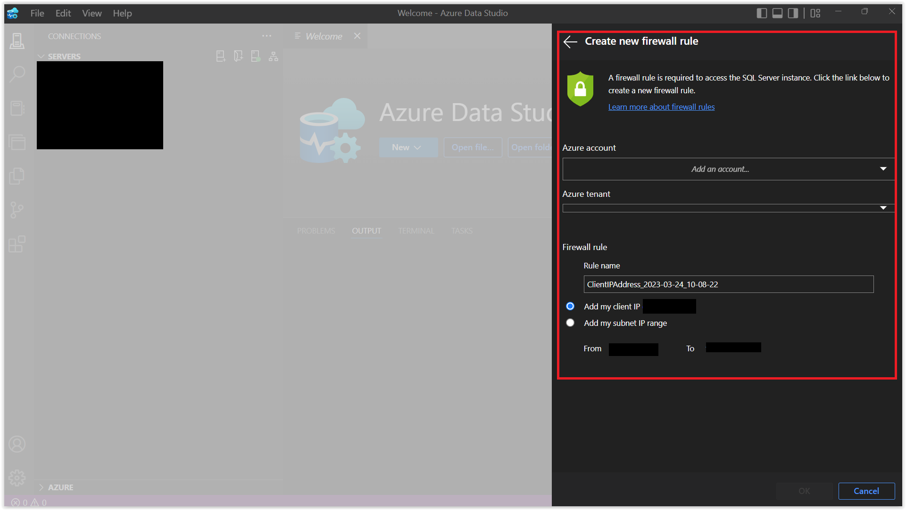
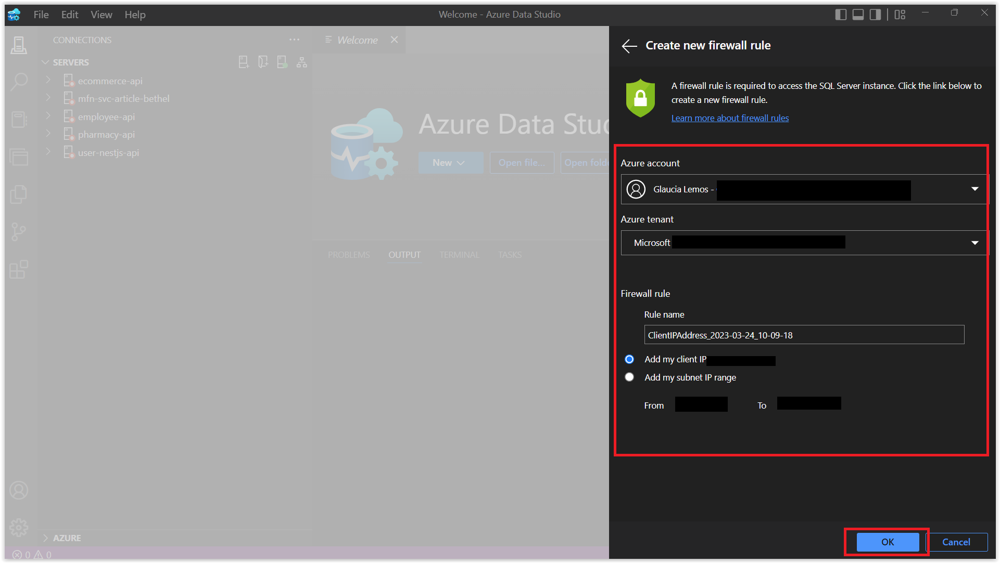
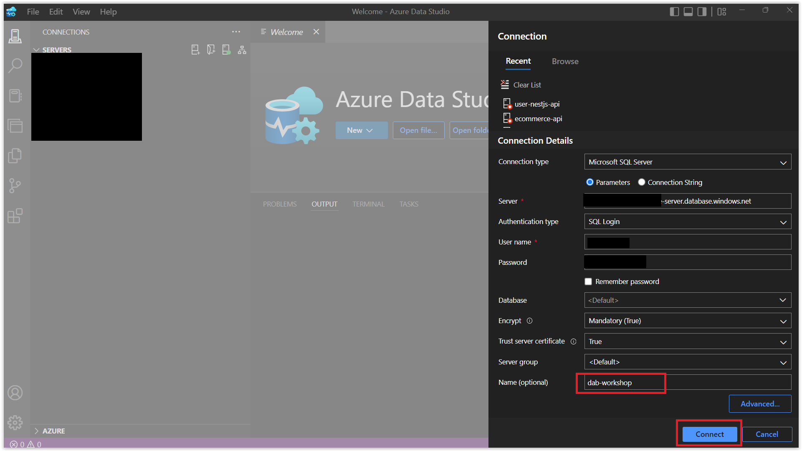
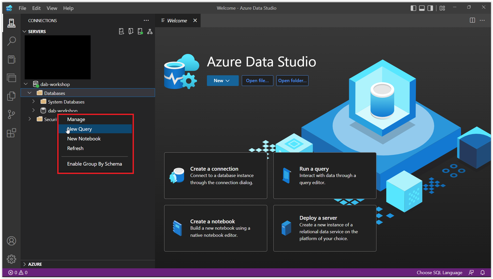
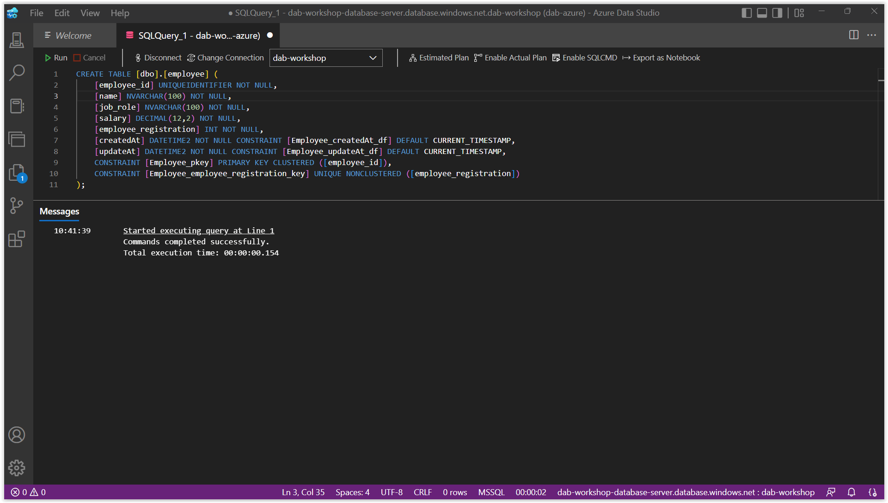

# Conectando a Base de Dados com Azure Data Studio

Para o nosso workshop, com intuito de aprender a ferramenta, estaremos trabalhando com uma tabela:

* `dbo.employee`: contém a tabela **Employee**

E, para criar essa tabela, estarei usando uma ferramenta chamada **[Azure Data Studio](https://azure.microsoft.com/products/data-studio/?WT.mc_id=javascript-75515-gllemos)**. O Azure Data Studio é uma ferramenta incrível. O seu design lembra muito o Visual Studio Code e é muito leve e simples de usar. 

Inclusive você pode usar extensões para usar por exemplo: Oracle, MySQL ou PostgreSQL. E, não somente integração com Banco de Dados Relacionais, incluso também os Não Relacionais, tais como: MongoDB e Azure CosmosDB. 

E, sem contar que ele também dá suporte robusto a linguagens para: T-SQL, PowerShell, Python, KQL, Apache Spark TM e PySpark justamente com a intenção de gerenciar e consultar o SQL Server, o PostgreSQL e o Azure Data Explorer em um único lugar. Além disso, ele é multiplataforma e pode ser usado em Windows, Linux e Mac.

Bom, depois de realizar o download da ferramenta, vamos conectar com o nosso banco de dados. Para isso, vamos clicar no botão **New Connection** e preencher os dados conforme a imagem abaixo:

> se o status do seu serviço do Azure SQL estiver como 'Paused' no Azure Portal, você precisará ir até: `Settings -> Compute + Storage -> Compute Hardware -> Auto-pause delay` e desmarcar a opção `Enable auto-pause` e depois clicar no botão `Apply` para que o serviço volte a funcionar.


Depois, basta colocar as informações de conexão com a base de dados que criamos anteriormente, conforme a imagem abaixo. Porém, clique em `Advanced` para que possamos colocar a porta do nosso banco de dados. Que nesse caso é a `1433`.



Retorne para a tela inicial e clique no combo `Database`. Aparecerá uma nova janela `Create new firewall rule`. Nessa janela aparecerá o IP da sua máquina e por consequencia para você se conectar na sua conta do Azure. Clique em `Add an account` e faça o login com a sua conta do Azure. Aparecerá as credenciais da sua conta e o seu `Azure Tenant` Após isso, clique em `Ok`.





Depois disso, basta colocar um nome dessa conexão. No meu caso eu coloquei `dab-workshop` e clique em `Connect`.



Agora, vamos criar a nossa tabela `Employee`. Para isso, clique com o botão direito do mouse na base de dados que você criou (conforme a imagem abaixo) e clique em `New Query`. Depois, cole o código abaixo e clique em `Run` para executar o script.



```sql
CREATE TABLE [dbo].[employee] (
    [employee_id] UNIQUEIDENTIFIER NOT NULL,
    [name] NVARCHAR(100) NOT NULL,
    [job_role] NVARCHAR(100) NOT NULL,
    [salary] DECIMAL(12,2) NOT NULL,
    [employee_registration] INT NOT NULL,
    [createdAt] DATETIME2 NOT NULL CONSTRAINT [Employee_createdAt_df] DEFAULT CURRENT_TIMESTAMP,
    [updateAt] DATETIME2 NOT NULL CONSTRAINT [Employee_updateAt_df] DEFAULT CURRENT_TIMESTAMP,
    CONSTRAINT [Employee_pkey] PRIMARY KEY CLUSTERED ([employee_id]),
    CONSTRAINT [Employee_employee_registration_key] UNIQUE NONCLUSTERED ([employee_registration])
);
```

Se aparecer a mensagem `1 row(s) affected` significa que a tabela foi criada com sucesso.




**[⬅️ Voltar: Sessão 04](./04-session.md) | **[Próximo: Sessão 06 ➡️](./06-session.md)****

