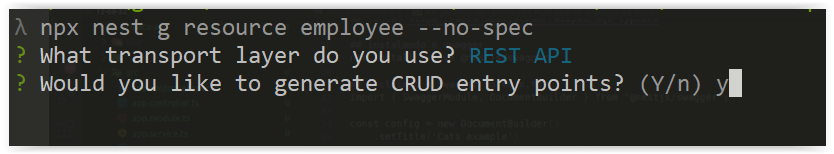
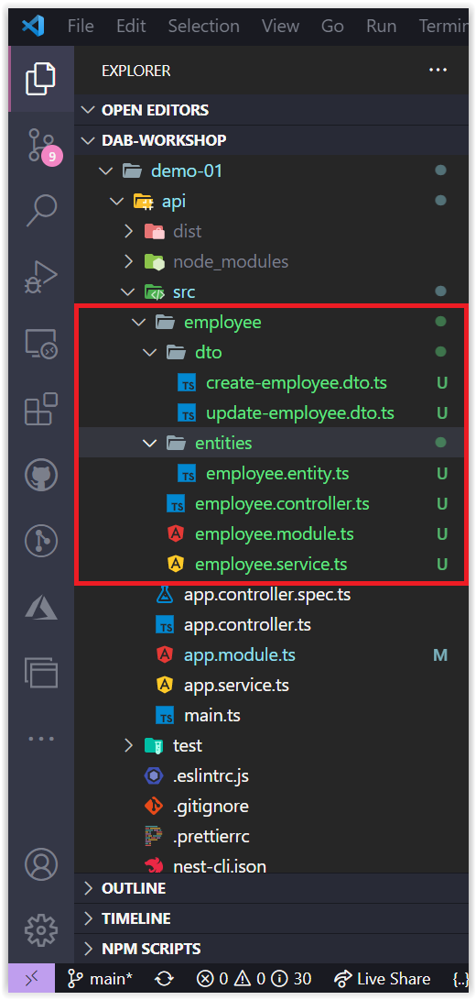

# Gerando Recursos da API - Employee

Nessa sessão vamos aprender gerar os recursos da API `Employee` fazendo uso do framework NestJS.

## Gerando CRUD para API - Employee

Vamos criar agora alguns arquivos relacionados a entidade `Employee` sem os arquivos de teste. Para isso, execute o seguinte comando:

```bash
npx nest g resource employee --no-spec
```

Logo em seguida aparecerá algumas opções conforme a imagem abaixo. Porém, vamos escolher a opção: **REST API**. E, depois aparecerá uma outra pergunta: _Would you like to generate CRUD entry points? (Y/n)_ e escolha a opção: **Y**



E finalmente irá gerar os arquivos conforme a imagem abaixo:



Perfeito! Vamos agora configurar a nossa base de dados! Mas isso na próxima sessão!

**[⬅️ Voltar: Sessão 04](./04-session.md) | **[Próximo: Sessão 06 ➡️](./06-session.md)****

