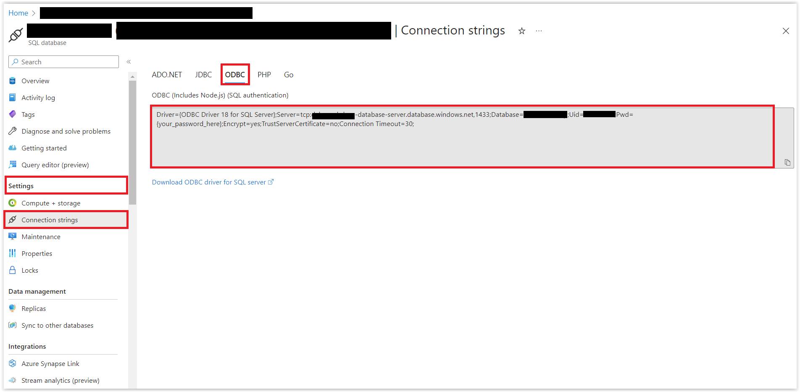

# Configurando a Base de Dados na Aplicação

Nessa sessão aprenderemos a como configurar e integrar a base de dados do Azure SQL com apli

## Inicindo a Configuração da Base de Dados

Dentro da pasta `src` crie uma pasta chamada `config/typeorm` e dentro dela crie um arquivo chamado `database.providers.ts` e adicione o seguinte código:

<details><summary><b>src/config/typeorm/data-source.ts</b></summary>

```typescript
import { DataSource } from 'typeorm';

export const typeOrmConfig = [
  {
    provide: 'DATA_SOURCE',
    useFactory: async () => {
      const dataSource = new DataSource({
        type: 'mssql',
        host: 'host',
        port: 1433,
        username: 'username',
        password: 'password',
        database: 'database',
        entities: [__dirname + '/../**/*.entity{.ts,.js}'],
        synchronize: true,
      });

      return dataSource.initialize();
    },
  },
];

```
</details>
<br/>

Agora será o momento que precisamos criar o nosso `.env`. Na raiz do projeto crie um arquivo chamado `.env` e adicione o seguinte código:

<details><summary><b>.env</b></summary>

```bash
DATABASE_HOST="<azure-sql-database-host>-server.database.windows.net"
DATABASE_PORT="1433"
DATABASE_NAME="<your-azure-sql-database-name>"
DATABASE_USERNAME="<your-azure-sql-database-username>"
DATABASE_PASSWORD="<your-azure-sql>"
DATABASE_ENCRYPT="true"
```

Essas informações vocês pode obter dentro do Azure no recurso criado na sessão 02. Porém, mais especificamente em: **Settings -> Connection Strings** e depois clique na aba: **ODBC**. Confira na imagem abaixo: 



Porém, se tiver alguma dúvida, pode conferir no arquivo `.env_template` disponível no repositório da aplicação. 

Bom, como vocês podem notar, estamos usando variáveis de ambiente. E com isso, precisamos instalar o pacote `dotenv` para que possamos usar essas variáveis. Para isso, execute o seguinte comando:

```bash
npm install dotenv --save
```

Agora retorne ao arquivo `data-source.ts` e modifique o arquivo conforme o código abaixo:

<details><summary><b>src/config/typeorm/database.providers.ts</b></summary>

```typescript
import { DataSource } from 'typeorm';
import * as dotenv from 'dotenv';

dotenv.config();

export const databaseProviders = [
  {
    provide: 'DATA_SOURCE',
    useFactory: async () => {
      const dataSource = new DataSource({
        type: 'mssql',
        host: process.env.DATABASE_HOST,
        port: Number(process.env.DATABASE_PORT),
        username: process.env.DATABASE_USERNAME,
        password: process.env.DATABASE_PASSWORD,
        database: process.env.DATABASE_NAME,
        options: {
          encrypt: true,
          enableArithAbort: true,
        },
        entities: [__dirname + '/../**/*.entity{.ts,.js}'],
        synchronize: true,
      });

      return dataSource.initialize();
    },
  },
];
```
</details>
<br/>

Precisamos agora criar um módulo para que possamos injetar o nosso `DATA_SOURCE` em outros lugares da aplicação. Para isso, crie um arquivo chamado `database.module.ts` dentro da pasta `src/config/typeorm` e adicione o seguinte código:

<details><summary><b>src/config/typeorm/database.module.ts</b></summary>

```typescript
import { Module } from '@nestjs/common';
import { databaseProviders } from './database.providers';

@Module({
  providers: [...databaseProviders],
  exports: [...databaseProviders],
})
export class DatabaseModule { }
```
</details>
<br/>

Ainda não acabou. Precisamos ainda criar um provider para a entidade `Employee`. Para isso, crie um arquivo chamado `employee.providers.ts` dentro da pasta `src/employee` e adicione o seguinte código:

<details><summary><b>src/employee/employee.providers.ts</b></summary>

```typescript
import { DataSource } from "typeorm";
import { Employee } from "./entities/employee.entity";

export const employeeProviders = [
  {
    provide: 'EMPLOYEE_REPOSITORY',
    useFactory: (dataSource: DataSource) => dataSource.getRepository(Employee),
    inject: ['DATA_SOURCE'],
  },
];
```
</details>
<br/>

Ufa! Conseguimos concluir a parte da configuração da Base de Dados da nossa aplicação. Agora vamos dar continuidade par enfim começar a criar os nossos endpoints.

**[⬅️ Voltar: Sessão 05](./05-session.md) | **[Próximo: Sessão 07 ➡️](./07-session.md)****


