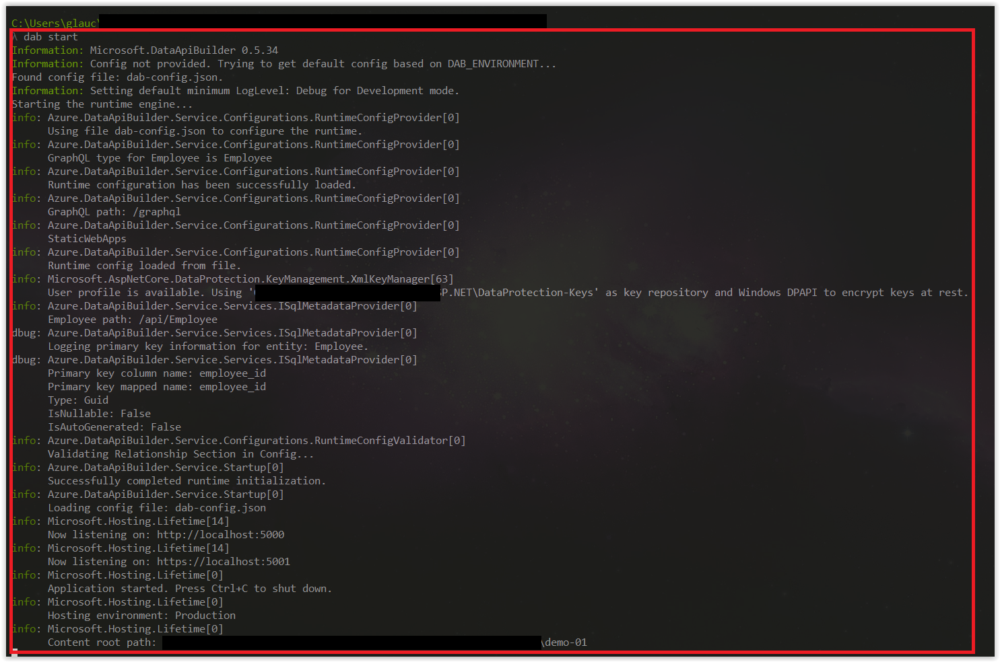
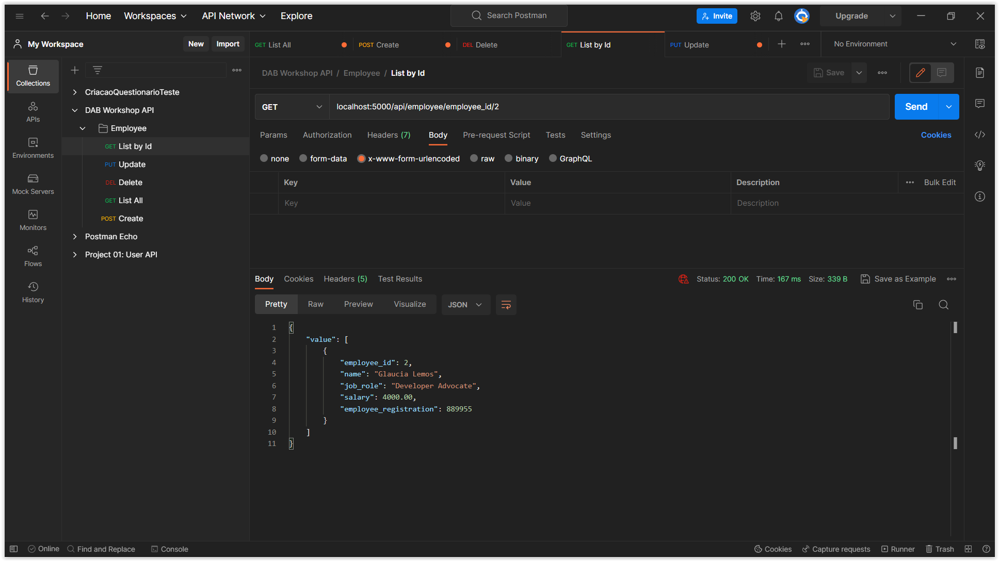

# Usando o Data API Builder com Azure SQL Database

Nessa sessão, aprenderemos como usar o Data API Builder para conectar a nossa API com o banco de dados Azure SQL Database.

Agora que já fizemos toda a configuração do nosso banco de dados usando o DAB CLI na sessão anterior, agora estamos prontos para usar a nossa API. Para isso, execute o seguinte comando:

```bash
dab start
```

> **Observação:** O comando `dab start` irá iniciar o servidor do DAB e expor a nossa API. Para parar o servidor, basta pressionar `Ctrl + C`.

Se ao executar o comando e aparecer a mensagem conforme a imagem abaixo, significa que o servidor foi iniciado com sucesso. Note que a porta indicada é a `5000`.



## Executando os Endpoints 

Agora é o momento que devemos testar a nossa API. Para isso, vamos usar o **[Postman](https://www.postman.com/)**. Mas, fica à vontade de usar qualquer outra ferramenta que você preferir.

Como a nossa entidade é `employee`, a rota será: `/api/employee`

Os verbos HTTP que possui suporte são:

- `GET`: para obter dados
- `POST`: para criar dados
- `PUT`: para atualizar dados
- `PATCH`: para atualizar dados parcialmente
- `DELETE`: para deletar dados

Vamos testar agora todas as rotas!

## Rota: POST

Para criar um novo empregado, abre o Postman e crie uma nova requisição:

- Tipo: `POST`: `http://localhost:5000/api/employee`

No Postman escolha a opção `Body -> raw` e inclua o seguinte JSON:

```json
{
    "name": "John Doe",
    "job_role": "Developer",
    "salary": 3000.00,
    "employee_registration": 778899
}
```

Veja a imagem abaixo:


E para ter certeza de que gravou na base de dados, abre o Azure Data Studio e execute o seguinte comando:

```sql
SELECT * FROM employees
```

Veja a imagem abaixo:


Já possuo alguns dados na minha base de dados, mas você pode ver que foi criado um novo empregado.

## Rota: GET

Para obter todos os empregados, abre o Postman e crie uma nova requisição:

- Tipo: `GET`: `http://localhost:5000/api/employee`

Retornará todos os empregados cadastrados.


## Rota: GET by ID

Para obter um empregado específico, abre o Postman e crie uma nova requisição:

- Tipo: `GET`: `localhost:5000/api/employee/employee_id/2`

Retornará o empregado com o ID 2.



Observe que a rota é composta por 3 partes:

- `/api/employee`: é a rota base
- `/employee_id`: é a primary key da coluna
- `/2`: é o valor da primary key

## Rota: PUT

Para atualizar um empregado, abre o Postman e crie uma nova requisição:

- Tipo: `PUT`: `http://localhost:5000/api/employee/employee_id/3`

No Postman escolha a opção `Body -> raw` e inclua o seguinte JSON:

```json
{
    "name": "Glaucia Lemos",
    "job_role": "Developer Advocate",
    "salary": 3000.00,
    "employee_registration": 445566,
    "createdAt": "2023-03-24T23:59:02",
    "updateAt": "2023-03-24T23:59:02"
}
```

## Rota: DELETE

Para deletar um empregado, abre o Postman e crie uma nova requisição:

- Tipo: `DELETE`: `http://localhost:5000/api/employee/employee_id/3`

E para ter certeza de que deletou na base de dados, abre o Azure Data Studio e execute o seguinte comando:

```sql
SELECT * FROM employees
```

Se deletou com sucesso, o registro não será mais exibido.

Se todas essas rotas foram executadas com sucesso, parabéns! Agora temos que integrar a nossa API com o nosso Frontend. Para isso, vamos para a próxima sessão.

**[⬅️ Voltar: Sessão 05](./05-session.md) | **[Próximo: Sessão 07 ➡️](./07-session.md)****