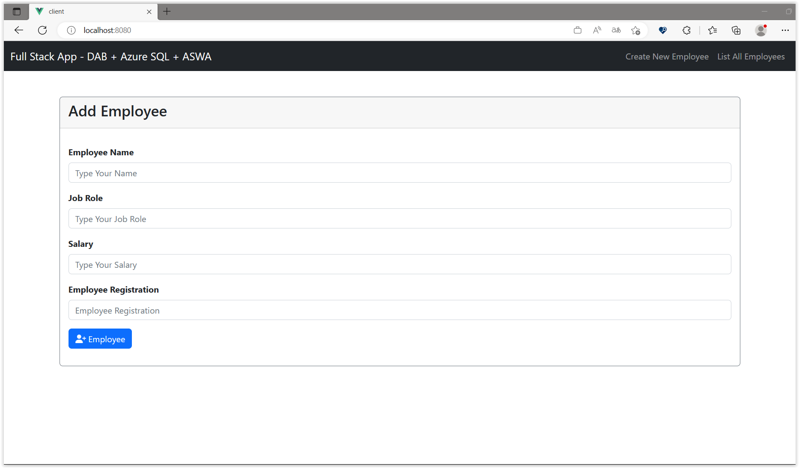
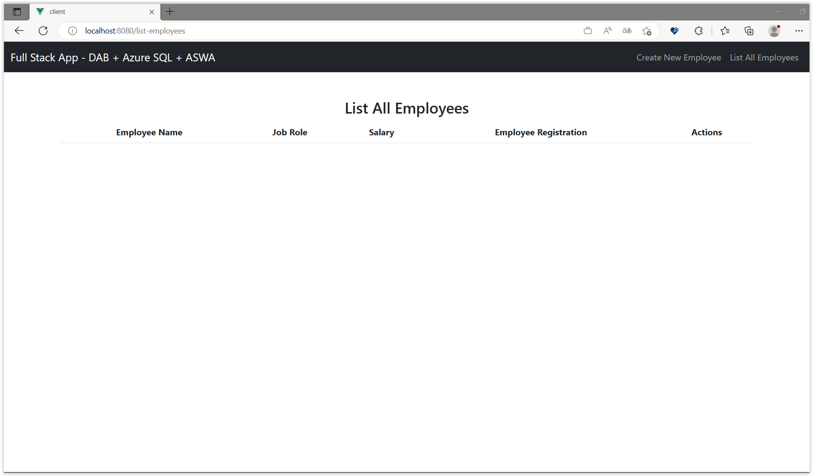
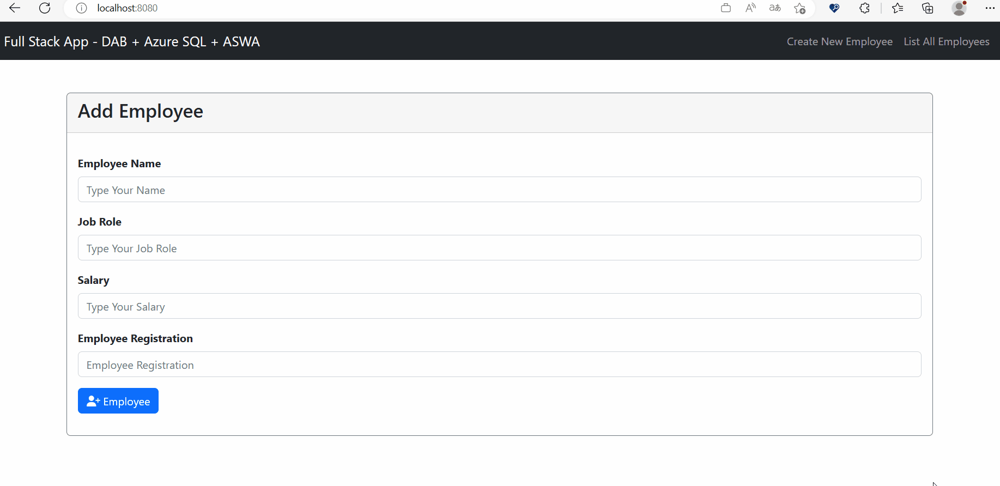

# Integrando DAB com Client-side (Front-End)

Nessa sessão, vamos integrar o DAB com o Vue.js, um framework JavaScript para construção de interfaces de usuário. 

## Entendendo um pouco a Aplicação Front-End

Para que o enfoque seja na integração com o DAB, vamos utilizar uma aplicação Vue.js já pronta. Aqui mesmo nesse repositório temos uma pasta chamada `demo-01` e dentro dela uma outra pasta chamada `client`. Essa pasta possui uma aplicação Vue.js, conforme a imagem abaixo:


Para executar a aplicação, precisamos antes instalar as dependências. Para isso, abra o terminal e navegue até a pasta `client` e execute o comando 

```bash
npm install
``` 

Após a instalação das dependências, execute o comando abaixo para iniciar a aplicação.

```bash
npm run serve
```

Agora, abra o navegador e acesse a URL `http://localhost:8080`. Você verá a seguinte tela:



A aplicação é bem simples. Ela possui alguns campos para informar alguns dados do `Employee`. Há também uma página para listar os `Employees` cadastrados, editá-los e excluí-los.



As páginas de listar, editar e excluir não funcionarão nesse momento porque precisaremos integrar o DAB com a aplicação.

Vamos fazer isso agora e não vou mentir para vocês, é bem simples.

## Integrando o DAB com a Aplicação Front-End

Para integrar o DAB com a aplicação precisaremos fazer algumas alterações no código da aplicação front-end. 

Vá até a pasta `client`. Depois vá até a pasta `services` e abra o arquivo `Api.js`. Esse arquivo é responsável por inicializar o axios, que é uma biblioteca para fazer requisições HTTP. 

```javascript
import axios from "axios";

export default () =>
  axios.create({
    baseURL: "http://localhost:5000/api",
  });
```

Aqui, estamos configurando o axios para apontar para a URL `http://localhost:5000/api`. Essa URL é a URL do nosso servidor DAB.

Agora, vamos alterar as URLs para que elas apontem para o DAB. 

Para isso, abre o arquivo `EmployeeService.js` e altere o código para o código abaixo:

<details><summary>Método: createNewEmployee</summary>

```javascript
  async createNewEmployee(employee) {
    try {
      const response = await Api().post('/employee', employee);
      return response.data.value;
    } catch (error) {
      if (error.response.status === 409) {
        throw new Error('Employee already exists!', error);
      }
      console.error(error);
      throw new Error('Error!');
    }
  },

```

</details>
</br>

O mesmo será para os demais métodos. 

<details><summary>Método: getAllEmployees</summary>

```javascript
  async getEmployees() {
    try {
      const response = await Api().get('/employee');
      return response.data.value;
    } catch (error) {
      console.error(error);
      throw new Error('Error!');
    }
  },
```

</details>
</br>

<details><summary>Método: getEmployeeById</summary>

```javascript
  async getEmployeeId(id) {
    try {
      const response = await Api().get(`/employee/employee_id/${id}`);
      return response.data.value[0];
    } catch (error) {
      if (error.response.status === 404) {
        throw new Error('Employee not found!', error);
      }
      console.error(error);
      throw new Error('Error!');
    }
  },
```

</details>
</br>

<details><summary>Método: updateEmployee</summary>

```javascript
  async updateEmployee(employee) {
    try {
      const id = employee.employee_id;
      const removeEmployeeId = { ...employee };
      delete removeEmployeeId.employee_id;

      const response = await Api().put(`/employee/employee_id/${id}`, removeEmployeeId);
      if (response.status === 200) {
        return response.data.value;
      }
      throw new Error('Error!');
    } catch (error) {
      if (error.response.status === 404) {
        throw new Error('Employee not found!', error);
      }
      console.error(error);
      throw new Error('Error!');
    }
  },
```

</details>
</br>

<details><summary>Método: deleteEmployee</summary>

```javascript
  async deleteEmployee(id) {
    try {
      const response = await Api().delete(`/employee/employee_id/${id}`);
      return response.data;
    } catch (error) {
      console.error(error);
      throw new Error('Error!');
    }
  },
```

</details>
</br>

Agora, vamos executar novamente a aplicação. Lembrando que, por questões do uso do CORS, precisamos executar o dab da seguinte forma:

```bash
dab start --no-https-redirect
```

Abre um outro terminal e execute a aplicação front-end:

```bash
npm run serve
```

Agora, abra o navegador e acesse a URL `http://localhost:8080`. Você verá a seguinte tela:



E, pronto! A aplicação está integrada com o DAB.

Mas, e se eu desejar realizar o deploy da aplicação usando o Azure Static Web Apps integrado com o DAB? Como faço isso? 

Veremos isso na próxima sessão.

**[⬅️ Voltar: Sessão 06](./06-session.md) | **[Próximo: Sessão 08 ➡️](./08-session.md)****


