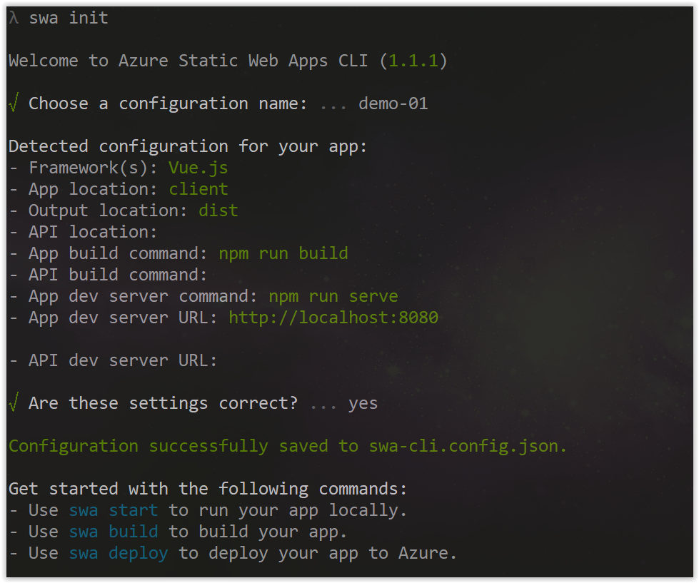
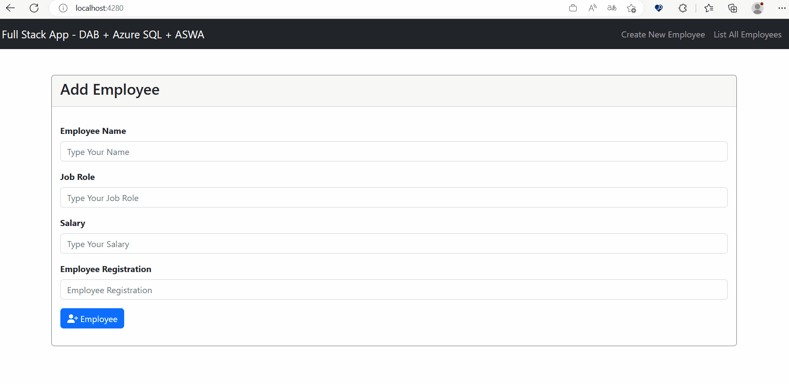

# Integrando DAB com Azure Static Web Apps

Nessa sessão, aprenderemos como podemos integrar o Data Api builder com o Azure Static Web Apps usando uma ferramenta chamada **[Azure Static Web Apps CLI](https://azure.github.io/static-web-apps-cli/)**.

## O que é Azure Static Web Apps?

O Azure Static Web Apps é um serviço de hospedagem de aplicativos estáticos e dinâmicos que permite que você crie e hospede aplicativos da Web modernos sem ter que gerenciar servidores ou infraestrutura. Ele combina o poder do Azure App Service com o GitHub Actions para fornecer um fluxo de trabalho de desenvolvimento contínuo e implantação contínua (CI/CD) para aplicativos estáticos e dinâmicos.

Outra grande vantagem desse serviço é que você pode hospedar de forma gratuita seu aplicativo estático e dinâmico, sem custo adicional. 

Se você quiser saber mais sobre o Azure Static Web Apps, poderá obter mais informações no link abaixo:

- **[Documentação Oficial - Azure Static Web Apps](https://docs.microsoft.com/azure/static-web-apps/overview?WT.mc_id=javascript-75515-gllemos)**

## O que é Azure Static Web Apps CLI?

O Azure Static Web Apps CLI é uma ferramenta de linha de comando que permite que você crie, configure e implante aplicativos estáticos e dinâmicos no Azure Static Web Apps. 

- **[Documentação Oficial - SWA CLI](https://azure.github.io/static-web-apps-cli/docs/intro)**

## Instalando o Azure Static Web Apps CLI

Para instalar o Azure Static Web Apps CLI, você pode usar o seguinte comando:

```bash
npm install -g @azure/static-web-apps-cli
```

## Criando a Configuração do DAB com o SWA CLI

Para criar a configuração do DAB com o SWA CLI, você pode usar o seguinte comando:

```bash
swa db init --database-type mssql
``` 

Esse comando criará um um folder chamado `swa-db-connections` e dentro dele teremos um arquivo chamado `staticwebapp.database.config.json`.

Veja o conteúdo do arquivo:

<details><summary>staticwebapp.database.config.json</summary>

```json
{
  "$schema": "https://github.com/Azure/data-api-builder/releases/download/v0.5.35/dab.draft.schema.json",
  "data-source": {
    "database-type": "mssql",
    "options": {
      "set-session-context": false
    },
    "connection-string": ""
  },
  "runtime": {
    "rest": {
      "enabled": true,
      "path": "/rest"
    },
    "graphql": {
      "allow-introspection": true,
      "enabled": true,
      "path": "/graphql"
    },
    "host": {
      "mode": "production",
      "cors": {
        "origins": ["http://localhost:4280"],
        "allow-credentials": false
      },
      "authentication": {
        "provider": "StaticWebApps"
      }
    }
  },
  "entities": {}
}
```

</details>
</br>

Vamos agora criar a nossa entidade `Employee`. Será muito parecido com o que fizemos em uma das sessões anteriores. Esse comando deverá ser executado dentro da pasta `swa-db-connections`:

```bash
dab add employee --source dbo.employees --permissions "anonymous:*" -c staticwebapp.database.config.json
```

Abre o arquivo `staticwebapp.database.config.json` e veja que agora temos a entidade `Employee`:

<details><summary>staticwebapp.database.config.json</summary>

```json
  "entities": {
    "employee": {
      "source": "dbo.employees",
      "permissions": [
        {
          "role": "anonymous",
          "actions": [
            "*"
          ]
        }
      ]
    }
  }

(...)
```

</details>
</br>

## Configurando a Connection String

Precisamos configurar a connection string do nosso banco de dados, da mesma forma que fizemos no DAB. Para isso, abra o arquivo `staticwebapp.database.config.json` e altere o valor da propriedade `connection-string` para o seguinte:

```json
"connection-string": "@env('DATABASE_CONNECTION_STRING')"
```

## Criando o Arquivo de Configuração do SWA CLI

Agora, precisaremos criar um outro arquivo, chamado `swa-cli.config.json`. Esse arquivo será responsável por armazenar as configurações do Azure Static Web Apps CLI.

Para criar esse arquivo, execute o seguinte comando na raiz do projeto:

```bash
swa init
```

Haverá algumas perguntas que você deverá responder de acordo com o seu projeto. Veja a imagem abaixo:



Agora abre o arquivo e veja o conteúdo do arquivo:

<details><summary>swa-cli.config.json</summary>

```json
{
  "$schema": "https://aka.ms/azure/static-web-apps-cli/schema",
  "configurations": {
    "dab-swa-azure-sql-workshop": {
      "appLocation": "client",
      "outputLocation": "dist",
      "appBuildCommand": "npm run build",
      "run": "npm run serve",
      "appDevserverUrl": "http://localhost:8080"
    }
  }
}
```

</details>
</br>

## Alterando o endpoint no Client-Side

Precisamos agora apontar o endpoint to swa para o nosso projeto. Para isso, abre o arquivo `client/src/Api.js` e altere o endpoint para o seguinte:

```javascript
import axios from "axios";

export default () =>
  axios.create({
    // ==> ASWA request (development/production)
    baseURL: "/data-api/rest",
  });
```

Observe que agora estamos apontando para o endpoint do Azure Static Web Apps CLI. E outro ponto bastante interessante, que esse endpoint é diferente do endpoint que usamos no DAB. Isso acontece porque o Azure Static Web Apps CLI é um proxy que faz a comunicação entre o seu aplicativo e o Data Api builder.

O endpoint do Azure Static Web Apps CLI é composto da seguinte forma:

```bash
http://localhost:4280/data-api/rest/<NOME-ENTIDADE>
```

Feito isso, vamos agora executar o comando de `build` do nosso projeto. Para isso, vá até a pasta `client` e execute o seguinte comando:

```bash
swa build
``` 

## Executando o Azure Static Web Apps CLI com o DAB

Agora que está tudo preparado e configurado, vamos executar o Azure Static Web Apps CLI. Para isso, execute o seguinte comando:

```bash
swa start --data-api-location swa-db-connections
```

Observe novamente que estamos passando o parâmetro `--data-api-location` e informando o caminho da pasta `swa-db-connections`. Isso pode variar de acordo com o seu projeto, talvez tendo que especificar onde se encontra o arquivo `staticwebapp.database.config.json`.

Observe na imagem abaixo que o Azure Static Web Apps CLI está executando e que o Data Api builder em paralelo:


Agora abrem o navegador e acessem o seguinte endereço:

```bash
http://localhost:4280/
```

E, veja que a aplicação funcionará normalmente:



Se tudo ocorreu bem, você deverá ver a aplicação funcionando normalmente. 

Agora estamos prontos para fazer o deploy do nosso projeto no Azure Static Web Apps. Mas isso faremos na última sessão do nosso workshop.

**[⬅️ Voltar: Sessão 07](./07-session.md)**
| **[Próximo: Sessão 09 ➡️](./09-session.md)**


