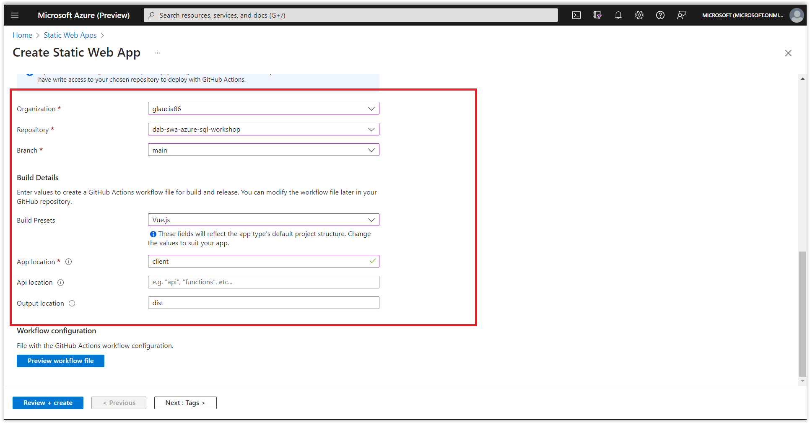
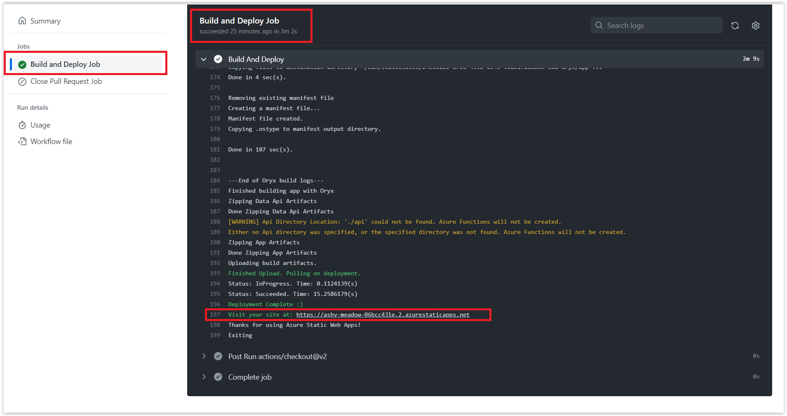

# Deployment da Aplicação no Azure Static Web Apps

Nesta sessão, iremos realizar o deploy da aplicação no Azure Static Web Apps. Nesse momento você precisará ter uma conta no Azure. 

> Caso você não tenha, você pode criar uma conta gratuita clicando: **[AQUI](https://azure.microsoft.com/free/?WT.mc_id=javascript-75515-gllemos)**. E se você é estudante ou professor, você pode criar uma conta com $100 de crédito e sem cartão de crédito clicando: **[AQUI](https://azure.microsoft.com/free/students/?WT.mc_id=javascript-75515-gllemos)**.

## Criando arquivo de configuração do Azure Static Web Apps

Para evitar problemas em relação a configuração do Azure Static Web Apps, vamos criar um arquivo de configuração para o mesmo. Para isso, vamos criar um arquivo chamado `staticwebapp.config.json` dentro da pasta `client`. O conteúdo do arquivo deve ser o seguinte:

```json
{
  "navigationFallback": {
    "rewrite": "/index.html",
    "exclude": ["/css/*", "/js/*", "/api/*", "/favicon.ico"]
  }
}
```

O que esse arquivo fará? Ele irá configurar o Azure Static Web Apps para que ele sempre redirecione para a página `index.html` quando uma página não for encontrada. Além disso, ele irá excluir alguns arquivos que não precisam ser enviados para o Azure Static Web Apps.

## Criando o Repositório no GitHub

Para que possamos realizar o deploy da aplicação no Azure Static Web Apps, precisamos criar um repositório da aplicação no GitHub. 

> Caso você não saiba como criar um repositório no GitHub, você pode seguir o tutorial: **[Creating a new repository](https://docs.github.com/en/github/getting-started-with-github/create-a-repo)**.


## Integrando a aplicação com o Azure Static Web Apps

Bom, agora que já temos o projeto no GitHub, agora é o momento que vamos integrar a aplicação com o Azure Static Web Apps. Para isso, abre o Portal do Azure e faça o login com a conta que você criou anteriormente.

Depois, vá até search bar e digite `Static Web Apps`. Clique no serviço que aparecerá.


Depois de clicar no serviço, clique em `Create`. Abrirá uma nova janela. Nessa janela, você precisará preencher alguns campos:

- **Subscription**: Selecione a assinatura que você criou anteriormente.
- **Resource Group**: Crie um novo grupo de recursos.
- **Static Web App name**: Digite um nome para o seu aplicativo.
- **Hosting Plan**: Selecione `Free`.
- **Location**: Selecione a região que você deseja.
- **Deployment details**: Selecione `GitHub`.
- **GitHub Account**: Selecione a conta do GitHub que você criou anteriormente ou a conta que você possui.
- **Organization**: Selecione a organização onde se encontra o repositório.
- **Repository**: Selecione o repositório que você criou anteriormente.
- **Branch**: Selecione a branch que você deseja. No meu caso é a `main`.
- **Build Preset**: Selecione `Vue.js`.
- **App location**: Digite `./client`.
- **Api location**: Deixa em branco.
- **Output location**: Digite `dist`.

Veja nas imagens abaixo como ficou a configuração:




Clique em `Review + create` e depois em `Create`. Aguarde alguns minutos até que o Azure Static Web Apps seja criado.

E logo em seguida clique em `Go to resource`.

Ao clicar em `Go to resource`, você será redirecionado para a página do Azure Static Web Apps. Nessa página, você verá algumas informações sobre o seu aplicativo. Veja na imagem abaixo:


## Conectando a base de dados no Azure Static Web Apps

Agora que já temos o serviço criado, precisamos conectar a base de dados da aplicação. Para isso, na mesma página do Azure Static Web Apps, clique em `Database Connection (preview)`.


Abrirá uma janela. Nessa janela, clique em `Link existing database`.

Novamente, abrirá uma janela. Nessa janela, você precisará preencher alguns campos:

- **Database type**: Selecione `SQL Database`.
- **Subscription**: Selecione a assinatura que você criou anteriormente.
- **Resource Group**: Selecione o grupo de recursos que você criou anteriormente.
- **Resource name**: Selecione o nome do banco de dados que você criou anteriormente.
- **Database name**: Selecione o nome do banco de dados que você criou anteriormente.
- **Username**: Digite o nome do usuário que você criou anteriormente.
- **Password**: Digite a senha que você criou anteriormente.

Se tiver dúvidas, veja na imagem abaixo como ficou a configuração:


Antes clicar em `Link`, precisaremos averiguar se o banco de dados está permitindo acessar o Azure Static Web Apps. Para isso, vamos abrir o portal do Azure (sem fechar a outra aba) e vamos até o server do banco de dados que criamos anteriormente.

Vá até `Security` e depois `Networking`. Abrirá uma nova janela. Nessa janela, vá até o final em `Exceptions` e clique em `Allow Azure Services and resources to access this server` e depois em `Save`.


Feito isso, agora podemos clicar em: `I acknowledge the steps needed to enable this static web app to connect to my database` e depois em `Link`. 


Agora precisamos definir o `data_api_location`. Como faremos isso? Abre o seu prompt comando e digite o seguinte comando:

```bash
git pull
```

Ao fazer isso, você verá que terá uma pasta chamada `.github` na raiz do projeto. Nessa pasta, você verá um arquivo chamado `workflows`. Nessa pasta, você verá um arquivo chamado `azure-static-web-apps-<nome-do-seu-app>.yml`. 

Abra o arquivo e verá que ele está assim:

> esse arquivo é gerado pelo meu GH Actions. O seu será gerado com alguns secrets diferentes.

<details><summary>azure static web apps yaml file (sample)</summary>

```yml
name: Azure Static Web Apps CI/CD

on:
  push:
    branches:
      - main
  pull_request:
    types: [opened, synchronize, reopened, closed]
    branches:
      - main

jobs:
  build_and_deploy_job:
    if: github.event_name == 'push' || (github.event_name == 'pull_request' && github.event.action != 'closed')
    runs-on: ubuntu-latest
    name: Build and Deploy Job
    steps:
      - uses: actions/checkout@v2
        with:
          submodules: true
      - name: Build And Deploy
        id: builddeploy
        uses: Azure/static-web-apps-deploy@v1
        with:
          azure_static_web_apps_api_token: ${{ secrets.AZURE_STATIC_WEB_APPS_API_TOKEN_ASHY_MEADOW_06BCC431E }}
          repo_token: ${{ secrets.GITHUB_TOKEN }} # Used for Github integrations (i.e. PR comments)
          action: 'upload'
          ###### Repository/Build Configurations - These values can be configured to match your app requirements. ######
          # For more information regarding Static Web App workflow configurations, please visit: https://aka.ms/swaworkflowconfig
          app_location: './client'
          output_location: 'dist'
          ###### End of Repository/Build Configurations ######

  close_pull_request_job:
    if: github.event_name == 'pull_request' && github.event.action == 'closed'
    runs-on: ubuntu-latest
    name: Close Pull Request Job
    steps:
      - name: Close Pull Request
        id: closepullrequest
        uses: Azure/static-web-apps-deploy@v1
        with:
          azure_static_web_apps_api_token: ${{ secrets.AZURE_STATIC_WEB_APPS_API_TOKEN_ASHY_MEADOW_06BCC431E }}
          action: 'close'
```

</details>
</br>

Depois que o GitHub Actions finalizar os jobs e mostrar que tudo estiver verde.


No próprio job do Build do GitHub Actions ele mostra o link da aplicação. Clique no link e veja se a aplicação está funcionando.



Vejamos em ação a aplicação, que agora está hospedada na nuvem com a base de dados integrada com ajuda do Data Api Builder e Azure Static Web Apps.


Se tudo estiver funcionando conforme o esperado, parabéns! Você concluiu o workshop.

Se desejar ver o código final do projeto, acesse o repositório do GitHub: **[AQUI](https://github.com/glaucia86/dab-swa-azure-sql-workshop)**

**[⬅️ Voltar: Sessão 08](./08-session.md) | **[Próximo: Sessão 10 ➡️](./10-session.md)****


